Drug_Consumption_Analysis
================
2025-12-02

# Data Processing

``` r
data_one <- read.csv("data/Drug_consumption.csv")
data_one <- data_one |> select(-Semer)

data_two <- data_one |> pivot_longer(
  cols = Alcohol:VSA,
  names_to = "drug_type",
  values_to = "consumption_level"
)

data_two <- data_two |> mutate(consumption_binary = case_when(
  consumption_level == "CL6" | consumption_level == "CL5" | consumption_level == "CL4" | consumption_level == "CL3" |
    consumption_level == "CL2" ~ "User",
  consumption_level == "CL1" | consumption_level == "CL0" ~ "Non-user"
))

data_three <- data_two |> group_by(ID) |>
  summarise(user_status = sum(consumption_binary == "User"))

data_two <- data_two |> mutate(consumption_legal = case_when(
  drug_type == "Alcohol" | drug_type == "Caff" | drug_type == "Nicotine" |
                          drug_type == "Choc" | drug_type == "Amyl" | drug_type == "Legalh" ~ "legal",
  drug_type == "Benzos" | drug_type == "Amphet" | drug_type == "Cannabis" |
                             drug_type == "Coke" | drug_type == "Crack" | drug_type == "Ecstasy" |
                             drug_type == "Heroin" | drug_type == "Ketamine" | drug_type == "LSD" |
                             drug_type == "Meth" | drug_type == "Mushrooms" | drug_type == "VSA" ~ "illegal"
))

data_one <- left_join(data_one, data_three)
```

    ## Joining with `by = join_by(ID)`

``` r
data_one$user_status_real = factor(data_one$user_status, ordered = TRUE, levels = c(
  0, 1, 2, 3, 4, 5, 6, 7, 8, 9, 10, 11, 12, 13, 14, 15, 16, 17, 18, 19, 20
))

data_one_prime <- read.csv("data/cleaned_drug_data.csv")
data_one_prime <- data_one_prime |> pivot_longer(
  cols = Alcohol:VSA,
  names_to = "drug_type",
  values_to = "consumption_level"
)

data_one_prime_user_status <- data_one_prime |> group_by(ID) |>
  summarise(user_consumption_level = sum(consumption_level))

data_one <- left_join(data_one, data_one_prime_user_status)
```

    ## Joining with `by = join_by(ID)`

``` r
data_one_prime_prime <- data_one_prime |> pivot_wider(
  names_from = drug_type,
  values_from = consumption_level
)

data_one_prime_prime <- left_join(data_one_prime_prime, data_one_prime_user_status)
```

    ## Joining with `by = join_by(ID)`

``` r
data_one_prime_use_no_use <-
  data_one_prime_prime |> mutate(across(Alcohol:VSA, ~case_when(
    . == 0 | . == 1 ~ "Not User",
    . == 2 | . == 3 | . == 4 | . == 5 | . == 6 ~ "User"
  ), .names = "{.col}_binary"))
```

# Drug Consumption and Drug Type

To analyze drug consumption for each user, we converted all ordinal
measures for each drug into numeric variables. Then, they were added
together to calculate the total drug consumption level. A binary
variable was also created for each drug to detail whether each
participant was a user of that drug or not. For example, if a
participant had an 0 or 1 level of consumption for alcohol, that person
would be classified as a non-user of alcohol. However, for consumption
levels of 2 or higher, that participant would be classified as a user.
Finally, a variable of user-status was created to measure how many drugs
a participant was using, legal and illegal.

    ## `summarise()` has grouped output by 'consumption_legal'. You can override using
    ## the `.groups` argument.

|           | Statistic          |  Value |
|:----------|:-------------------|-------:|
| X-squared | Chi-squared        | 8709.9 |
| df        | Degrees of Freedom |    6.0 |
|           | P-Value            |    0.0 |

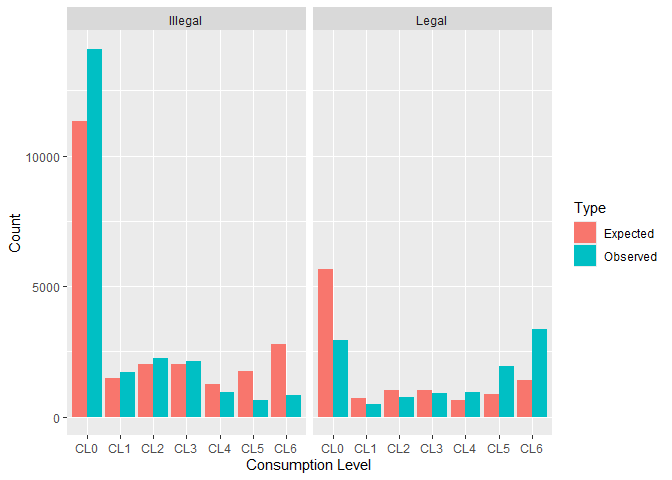<!-- -->

To see whether the type of drug–legal or illegal–a person takes has any
relationship to the consumption level of said drug, we conducted a
chi-squared test for the two categorical variables. The results of the
test, with a p-value of close to 0, suggests a significant association.

To examine the direction of this relationship, 2 bar graphs–for both
legal and illegal drugs–was constructed to compare the expected
frequency and the observed frequency for all consumption levels. For
illegal drugs, the observed counts for consumption levels 0, 1, 2, and 3
are all higher than the expected frequency. Meanwhile, the observed
counts are all much lower than the expected counts for consumption
levels 4, 5, and 6.

By contrast, for legal drugs, the observed counts for consumption levels
0, 1, 2, and 3 are all lower than the expected frequency. Meanwhile, the
observed counts are all much higher than the expected counts for
consumption levels 4, 5, and 6.

These results indicate that consumption levels are generally higher for
legal drugs compared to illegal drugs.

``` r
plot_histogram_1 <- data_one |>
  ggplot(aes(x = as.numeric(user_consumption_level))) +
  geom_histogram(bins = 50)

plot_histogram_2 <- data_one |>
  ggplot(aes(x = log1p(as.numeric(user_consumption_level)))) +
  geom_histogram(bins = 50)

plot_histogram_patch <- plot_histogram_1 + plot_histogram_2
plot_histogram_patch
```

    ## Warning: Removed 8 rows containing non-finite outside the scale range (`stat_bin()`).
    ## Removed 8 rows containing non-finite outside the scale range (`stat_bin()`).

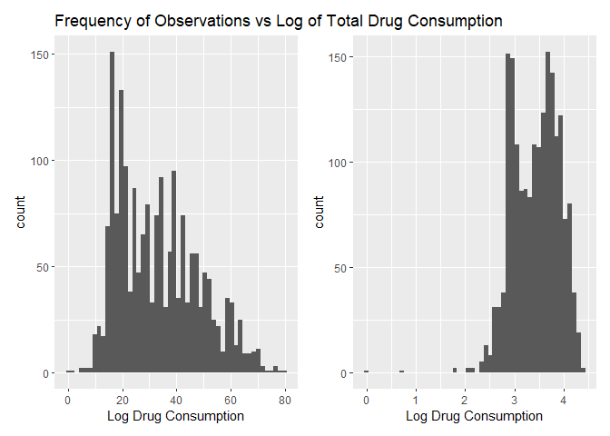<!-- -->

Along this direction, we wanted to examine whether total drug
consumption for a participant can be predicted by examining the types of
drugs a person uses.

To predict this model, we first examined the distribution of the drug
consumption level.However, this distribution was heavily skewed to the
right. Thus, by transforming the variable into the log of total drug
consumption, we are able to get a much more approximately normal
distribution, suited for linear regression.

Predictors were the binary variables that detail whether a participant
used or didn’t use said drug.

``` r
model_user_binary_consumption <- lm(log1p(user_consumption_level) ~ Alcohol_binary + Amphet_binary + Amyl_binary +
                                      Benzos_binary + Caff_binary + Cannabis_binary + Choc_binary + Coke_binary + 
                                      Crack_binary + Ecstasy_binary + Heroin_binary + Ketamine_binary +
                                      Legalh_binary + LSD_binary + Meth_binary + Mushrooms_binary + Nicotine_binary +
                                      VSA_binary, data_one_prime_use_no_use)
model_user_binary_consumption |> summary() |> broom::glance() |>
  mutate(model = c("Drug Type Consumption")) |>
  relocate(model) |>
  kbl(
    caption     = "Key Statistics for Prediction of OCEAN Scores from User Consumption"
    , col.names = c(
        "Model", "R-squared", "Adj. R-squared"
      , "Sigma", "F-statistic", "p-value", "df", "Residual df", "N"
    )
    , digits    = c(3, 3, 3, 3, 3, 3, 3, 3, 3)
  )
```

<table>

<caption>

Key Statistics for Prediction of OCEAN Scores from User Consumption
</caption>

<thead>

<tr>

<th style="text-align:left;">

Model
</th>

<th style="text-align:right;">

R-squared
</th>

<th style="text-align:right;">

Adj. R-squared
</th>

<th style="text-align:right;">

Sigma
</th>

<th style="text-align:right;">

F-statistic
</th>

<th style="text-align:right;">

p-value
</th>

<th style="text-align:right;">

df
</th>

<th style="text-align:right;">

Residual df
</th>

<th style="text-align:right;">

N
</th>

</tr>

</thead>

<tbody>

<tr>

<td style="text-align:left;">

Drug Type Consumption
</td>

<td style="text-align:right;">

0.883
</td>

<td style="text-align:right;">

0.882
</td>

<td style="text-align:right;">

0.16
</td>

<td style="text-align:right;">

778.647
</td>

<td style="text-align:right;">

0
</td>

<td style="text-align:right;">

18
</td>

<td style="text-align:right;">

1857
</td>

<td style="text-align:right;">

1876
</td>

</tr>

</tbody>

</table>

From the summary of our model, the adjusted R-squared value is equal to
0.882. This suggests a good fit and that the total drug consumption
level can be approximately modeled from which drugs a person uses. The
estimated parameters of this fit are also shown in the following table.

``` r
model_user_binary_consumption |> summary() |>
  broom::tidy() |>
  kbl(
      caption     = "Types of Drugs Consumed on Drug Consumption Level"
    , col.names   = c("Predictor", "Estimate", "SE", "t-statistic", "p-value")
    , digits      = c(3, 3, 3, 3, 3)
  )
```

<table>

<caption>

Types of Drugs Consumed on Drug Consumption Level
</caption>

<thead>

<tr>

<th style="text-align:left;">

Predictor
</th>

<th style="text-align:right;">

Estimate
</th>

<th style="text-align:right;">

SE
</th>

<th style="text-align:right;">

t-statistic
</th>

<th style="text-align:right;">

p-value
</th>

</tr>

</thead>

<tbody>

<tr>

<td style="text-align:left;">

(Intercept)
</td>

<td style="text-align:right;">

1.965
</td>

<td style="text-align:right;">

0.038
</td>

<td style="text-align:right;">

51.217
</td>

<td style="text-align:right;">

0.000
</td>

</tr>

<tr>

<td style="text-align:left;">

Alcohol_binaryUser
</td>

<td style="text-align:right;">

0.207
</td>

<td style="text-align:right;">

0.020
</td>

<td style="text-align:right;">

10.139
</td>

<td style="text-align:right;">

0.000
</td>

</tr>

<tr>

<td style="text-align:left;">

Amphet_binaryUser
</td>

<td style="text-align:right;">

0.085
</td>

<td style="text-align:right;">

0.011
</td>

<td style="text-align:right;">

7.670
</td>

<td style="text-align:right;">

0.000
</td>

</tr>

<tr>

<td style="text-align:left;">

Amyl_binaryUser
</td>

<td style="text-align:right;">

0.031
</td>

<td style="text-align:right;">

0.011
</td>

<td style="text-align:right;">

2.941
</td>

<td style="text-align:right;">

0.003
</td>

</tr>

<tr>

<td style="text-align:left;">

Benzos_binaryUser
</td>

<td style="text-align:right;">

0.127
</td>

<td style="text-align:right;">

0.009
</td>

<td style="text-align:right;">

13.484
</td>

<td style="text-align:right;">

0.000
</td>

</tr>

<tr>

<td style="text-align:left;">

Caff_binaryUser
</td>

<td style="text-align:right;">

0.430
</td>

<td style="text-align:right;">

0.027
</td>

<td style="text-align:right;">

15.714
</td>

<td style="text-align:right;">

0.000
</td>

</tr>

<tr>

<td style="text-align:left;">

Cannabis_binaryUser
</td>

<td style="text-align:right;">

0.208
</td>

<td style="text-align:right;">

0.011
</td>

<td style="text-align:right;">

19.036
</td>

<td style="text-align:right;">

0.000
</td>

</tr>

<tr>

<td style="text-align:left;">

Choc_binaryUser
</td>

<td style="text-align:right;">

0.299
</td>

<td style="text-align:right;">

0.028
</td>

<td style="text-align:right;">

10.678
</td>

<td style="text-align:right;">

0.000
</td>

</tr>

<tr>

<td style="text-align:left;">

Coke_binaryUser
</td>

<td style="text-align:right;">

0.086
</td>

<td style="text-align:right;">

0.011
</td>

<td style="text-align:right;">

7.580
</td>

<td style="text-align:right;">

0.000
</td>

</tr>

<tr>

<td style="text-align:left;">

Crack_binaryUser
</td>

<td style="text-align:right;">

0.033
</td>

<td style="text-align:right;">

0.015
</td>

<td style="text-align:right;">

2.249
</td>

<td style="text-align:right;">

0.025
</td>

</tr>

<tr>

<td style="text-align:left;">

Ecstasy_binaryUser
</td>

<td style="text-align:right;">

0.092
</td>

<td style="text-align:right;">

0.012
</td>

<td style="text-align:right;">

7.448
</td>

<td style="text-align:right;">

0.000
</td>

</tr>

<tr>

<td style="text-align:left;">

Heroin_binaryUser
</td>

<td style="text-align:right;">

0.053
</td>

<td style="text-align:right;">

0.015
</td>

<td style="text-align:right;">

3.458
</td>

<td style="text-align:right;">

0.001
</td>

</tr>

<tr>

<td style="text-align:left;">

Ketamine_binaryUser
</td>

<td style="text-align:right;">

0.058
</td>

<td style="text-align:right;">

0.012
</td>

<td style="text-align:right;">

4.934
</td>

<td style="text-align:right;">

0.000
</td>

</tr>

<tr>

<td style="text-align:left;">

Legalh_binaryUser
</td>

<td style="text-align:right;">

0.132
</td>

<td style="text-align:right;">

0.011
</td>

<td style="text-align:right;">

12.560
</td>

<td style="text-align:right;">

0.000
</td>

</tr>

<tr>

<td style="text-align:left;">

LSD_binaryUser
</td>

<td style="text-align:right;">

0.059
</td>

<td style="text-align:right;">

0.012
</td>

<td style="text-align:right;">

4.835
</td>

<td style="text-align:right;">

0.000
</td>

</tr>

<tr>

<td style="text-align:left;">

Meth_binaryUser
</td>

<td style="text-align:right;">

0.114
</td>

<td style="text-align:right;">

0.011
</td>

<td style="text-align:right;">

10.016
</td>

<td style="text-align:right;">

0.000
</td>

</tr>

<tr>

<td style="text-align:left;">

Mushrooms_binaryUser
</td>

<td style="text-align:right;">

0.079
</td>

<td style="text-align:right;">

0.012
</td>

<td style="text-align:right;">

6.724
</td>

<td style="text-align:right;">

0.000
</td>

</tr>

<tr>

<td style="text-align:left;">

Nicotine_binaryUser
</td>

<td style="text-align:right;">

0.167
</td>

<td style="text-align:right;">

0.009
</td>

<td style="text-align:right;">

17.616
</td>

<td style="text-align:right;">

0.000
</td>

</tr>

<tr>

<td style="text-align:left;">

VSA_binaryUser
</td>

<td style="text-align:right;">

0.040
</td>

<td style="text-align:right;">

0.013
</td>

<td style="text-align:right;">

3.163
</td>

<td style="text-align:right;">

0.002
</td>

</tr>

</tbody>

</table>

To interpret these parameters, we can examine the relationship between
drug consumption level and a participant’s use of meth. If a participant
uses meth, then said user would have a log of total drug consumption
which is 0.114 higher than those who do not use meth. From statistical
analysis, since all the predictors have a p-value of approximately 0, we
can conclude that all these predictors have a significant association
with the log of total drug consumption.

# Intervention for Drug Consumption

After obtaining user drug consumption level, it is important to analyze
possible areas for treatment and rehabilitation. To that end, we
analyzed whether there was a significant association between total
consumption level and all OCEAN personality traits, impulsivity and
sensation-seeking. This way, it may be possible to predict and narrow
down personality traits that could use improvement.

From the histograms fo OCEAN scores, impulsivity and sensation-seeking,
we see that all distributions are approximately normal as to not
requiring any further variable transformation. The plots that
demonstrate total user consumption vs OCEAN scores–and its fit–are
displayed below. A table showing each model’s key statistics–including
R-squared and p-values–are also shown below.

``` r
model_user_Oscore <- lm(Oscore~user_consumption_level, data = data_one_prime_use_no_use)
plot_1 <- ggplot(data_one_prime_use_no_use, aes(user_consumption_level, Oscore)) +
  geom_point(color = "red") +
  geom_smooth(method="lm", se=TRUE, color="blue")

model_user_Cscore <- lm(Cscore~user_consumption_level, data = data_one_prime_use_no_use)
plot_2 <- ggplot(data_one_prime_use_no_use, aes(user_consumption_level, Cscore)) +
  geom_point() +
  geom_smooth(method="lm", se=TRUE, color="blue")

model_user_Escore <- lm(Escore~user_consumption_level, data = data_one_prime_use_no_use)
plot_3 <- ggplot(data_one_prime_use_no_use, aes(user_consumption_level, Escore)) +
  geom_point(color = "yellow") +
  geom_smooth(method="lm", se=TRUE, color="blue")

model_user_Ascore <- lm(Ascore~user_consumption_level, data = data_one_prime_use_no_use)
plot_4 <- ggplot(data_one_prime_use_no_use, aes(user_consumption_level, Ascore)) +
  geom_point(color = "orange") +
  geom_smooth(method="lm", se=TRUE, color="blue")

model_user_Nscore <- lm(Nscore~user_consumption_level, data = data_one_prime_use_no_use)
plot_5 <- ggplot(data_one_prime_use_no_use, aes(user_consumption_level, Nscore)) +
  geom_point(color = "purple") +
  geom_smooth(method="lm", se=TRUE, color="blue")

plot_patch <- (plot_1 + plot_2 + plot_3)/(plot_4 + plot_5)
plot_patch
```

    ## `geom_smooth()` using formula = 'y ~ x'
    ## `geom_smooth()` using formula = 'y ~ x'
    ## `geom_smooth()` using formula = 'y ~ x'
    ## `geom_smooth()` using formula = 'y ~ x'
    ## `geom_smooth()` using formula = 'y ~ x'

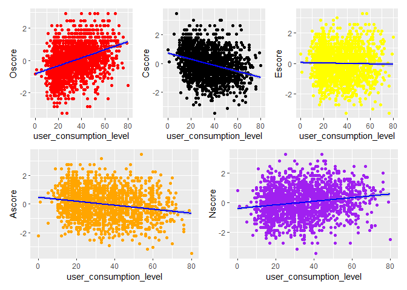<!-- -->

``` r
model_user_Oscore |> summary() |> broom::glance() |>
  bind_rows(summary(model_user_Cscore) |> broom::glance()) |>
  bind_rows(summary(model_user_Escore) |> broom::glance()) |>
  bind_rows(summary(model_user_Ascore) |> broom::glance()) |>
  bind_rows(summary(model_user_Nscore) |> broom::glance()) |>
  mutate(model = c("O score model", "C score model", "E score model", 
                   "A score model", "N score model")) |>
  relocate(model) |>
  kbl(
    caption     = "Key Statistics for Prediction of OCEAN Scores from User Consumption"
    , col.names = c(
        "Model", "R-squared", "Adj. R-squared"
      , "Sigma", "F-statistic", "p-value", "df", "Residual df", "N"
    )
    , digits    = c(3, 3, 3, 3, 3, 3, 3, 3, 3)
  )
```

<table>

<caption>

Key Statistics for Prediction of OCEAN Scores from User Consumption
</caption>

<thead>

<tr>

<th style="text-align:left;">

Model
</th>

<th style="text-align:right;">

R-squared
</th>

<th style="text-align:right;">

Adj. R-squared
</th>

<th style="text-align:right;">

Sigma
</th>

<th style="text-align:right;">

F-statistic
</th>

<th style="text-align:right;">

p-value
</th>

<th style="text-align:right;">

df
</th>

<th style="text-align:right;">

Residual df
</th>

<th style="text-align:right;">

N
</th>

</tr>

</thead>

<tbody>

<tr>

<td style="text-align:left;">

O score model
</td>

<td style="text-align:right;">

0.141
</td>

<td style="text-align:right;">

0.141
</td>

<td style="text-align:right;">

0.923
</td>

<td style="text-align:right;">

307.546
</td>

<td style="text-align:right;">

0.00
</td>

<td style="text-align:right;">

1
</td>

<td style="text-align:right;">

1874
</td>

<td style="text-align:right;">

1876
</td>

</tr>

<tr>

<td style="text-align:left;">

C score model
</td>

<td style="text-align:right;">

0.100
</td>

<td style="text-align:right;">

0.100
</td>

<td style="text-align:right;">

0.947
</td>

<td style="text-align:right;">

209.316
</td>

<td style="text-align:right;">

0.00
</td>

<td style="text-align:right;">

1
</td>

<td style="text-align:right;">

1874
</td>

<td style="text-align:right;">

1876
</td>

</tr>

<tr>

<td style="text-align:left;">

E score model
</td>

<td style="text-align:right;">

0.000
</td>

<td style="text-align:right;">

0.000
</td>

<td style="text-align:right;">

0.998
</td>

<td style="text-align:right;">

0.840
</td>

<td style="text-align:right;">

0.36
</td>

<td style="text-align:right;">

1
</td>

<td style="text-align:right;">

1874
</td>

<td style="text-align:right;">

1876
</td>

</tr>

<tr>

<td style="text-align:left;">

A score model
</td>

<td style="text-align:right;">

0.044
</td>

<td style="text-align:right;">

0.043
</td>

<td style="text-align:right;">

0.975
</td>

<td style="text-align:right;">

85.505
</td>

<td style="text-align:right;">

0.00
</td>

<td style="text-align:right;">

1
</td>

<td style="text-align:right;">

1874
</td>

<td style="text-align:right;">

1876
</td>

</tr>

<tr>

<td style="text-align:left;">

N score model
</td>

<td style="text-align:right;">

0.034
</td>

<td style="text-align:right;">

0.033
</td>

<td style="text-align:right;">

0.982
</td>

<td style="text-align:right;">

65.558
</td>

<td style="text-align:right;">

0.00
</td>

<td style="text-align:right;">

1
</td>

<td style="text-align:right;">

1874
</td>

<td style="text-align:right;">

1876
</td>

</tr>

</tbody>

</table>

The only personality trait that doesn’t have a significant association
with the total drug use consumption is Extraversion, which describes how
outgoing and sociable the subject is. This is concluded due to the model
having a p-value of 0.36, which is larger than a significance p-value of
0.05.

We also attempted to examine if there is a significant association
between the total drug use consumption and impulsive and sensation
seeking via. linear regression. Below, their association is plotted and
key statistics for the fit models–such as the R squared values– are
shown.

Unlike OCEAN scores, by examining our p-values, we can conclude that
total user drug consumption has a significant association with both
impulsivity and sensation-seeking.

``` r
model_user_Impulsivity <- lm(Impulsive~user_consumption_level, data = data_one_prime_use_no_use)
plot_6 <- ggplot(data_one_prime_use_no_use, aes(user_consumption_level, Impulsive)) +
  geom_point(color = "cyan") +
  geom_smooth(method="lm", se=TRUE, color="blue")

model_user_SS<- lm(SS~user_consumption_level, data = data_one_prime_use_no_use)
plot_7 <- ggplot(data_one_prime_use_no_use, aes(user_consumption_level, SS)) +
  geom_point(color = "green") +
  geom_smooth(method="lm", se=TRUE, color="blue")

plot_patch_2 = plot_6 + plot_7
plot_patch_2
```

    ## `geom_smooth()` using formula = 'y ~ x'
    ## `geom_smooth()` using formula = 'y ~ x'

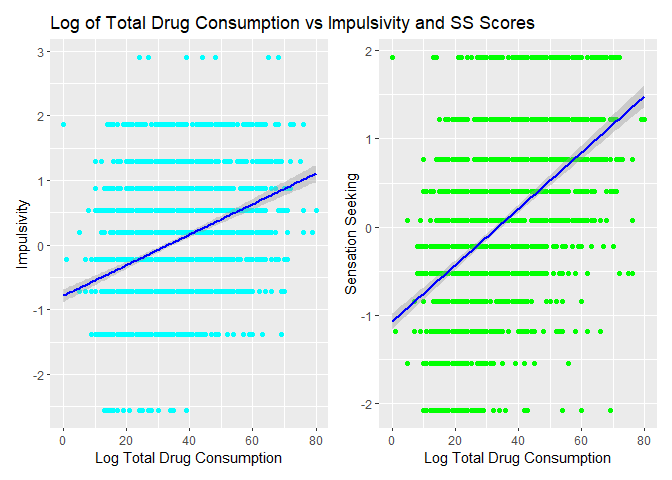<!-- -->

``` r
model_user_Impulsivity |> summary() |> broom::glance() |>
  bind_rows(summary(model_user_SS) |> broom::glance()) |>
  mutate(model = c("Impulsivity model", "Sensation Seeking model")) |>
  relocate(model) |>
  kbl(
    caption     = "Key Statistics for Prediction of Impulsivity and SS Scores from User Consumption"
    , col.names = c(
        "Model", "R-squared", "Adj. R-squared"
      , "Sigma", "F-statistic", "p-value", "df", "Residual df", "N"
    )
    , digits    = c(3, 3, 3, 3, 3, 3, 3, 3, 3)
  )
```

<table>

<caption>

Key Statistics for Prediction of Impulsivity and SS Scores from User
Consumption
</caption>

<thead>

<tr>

<th style="text-align:left;">

Model
</th>

<th style="text-align:right;">

R-squared
</th>

<th style="text-align:right;">

Adj. R-squared
</th>

<th style="text-align:right;">

Sigma
</th>

<th style="text-align:right;">

F-statistic
</th>

<th style="text-align:right;">

p-value
</th>

<th style="text-align:right;">

df
</th>

<th style="text-align:right;">

Residual df
</th>

<th style="text-align:right;">

N
</th>

</tr>

</thead>

<tbody>

<tr>

<td style="text-align:left;">

Impulsivity model
</td>

<td style="text-align:right;">

0.137
</td>

<td style="text-align:right;">

0.137
</td>

<td style="text-align:right;">

0.887
</td>

<td style="text-align:right;">

298.306
</td>

<td style="text-align:right;">

0
</td>

<td style="text-align:right;">

1
</td>

<td style="text-align:right;">

1874
</td>

<td style="text-align:right;">

1876
</td>

</tr>

<tr>

<td style="text-align:left;">

Sensation Seeking model
</td>

<td style="text-align:right;">

0.248
</td>

<td style="text-align:right;">

0.247
</td>

<td style="text-align:right;">

0.835
</td>

<td style="text-align:right;">

616.962
</td>

<td style="text-align:right;">

0
</td>

<td style="text-align:right;">

1
</td>

<td style="text-align:right;">

1874
</td>

<td style="text-align:right;">

1876
</td>

</tr>

</tbody>

</table>

Finally, all parametric estimates for all significant models are shown
in the table below.

``` r
model_user_Oscore |> summary() |> broom::tidy() |> filter(term %in% c("user_consumption_level")) |>
  bind_rows(summary(model_user_Cscore) |> broom::tidy() |> filter(term %in% c("user_consumption_level"))) |>
  bind_rows(summary(model_user_Ascore) |> broom::tidy() |> filter(term %in% c("user_consumption_level"))) |>
  bind_rows(summary(model_user_Nscore) |> broom::tidy() |> filter(term %in% c("user_consumption_level"))) |>
  bind_rows(summary(model_user_Impulsivity) |> broom::tidy() |> filter(term %in% c("user_consumption_level"))) |>
  bind_rows(summary(model_user_SS) |> broom::tidy() |> filter(term %in% c("user_consumption_level"))) |>
  mutate(model = c("Consumption on O score", "Consumption on C score",
                   "Consumption on A score", "Consumption on N score", "Consumption on Impulsivity",
                   "Consumption on Sensation Seeking")) |>
  relocate(model) |>
  kbl(
      caption     = "Effect of Psychological Predictors on Drug Consumption Levels"
    , col.names   = c("Model", "Predictor", "Estimate", "SE", "t-statistic", "p-value")
    , digits      = c(3, 3, 3, 3, 3)
  )
```

<table>

<caption>

Effect of Psychological Predictors on Drug Consumption Levels
</caption>

<thead>

<tr>

<th style="text-align:left;">

Model
</th>

<th style="text-align:left;">

Predictor
</th>

<th style="text-align:right;">

Estimate
</th>

<th style="text-align:right;">

SE
</th>

<th style="text-align:right;">

t-statistic
</th>

<th style="text-align:right;">

p-value
</th>

</tr>

</thead>

<tbody>

<tr>

<td style="text-align:left;">

Consumption on O score
</td>

<td style="text-align:left;">

user_consumption_level
</td>

<td style="text-align:right;">

0.025
</td>

<td style="text-align:right;">

0.001
</td>

<td style="text-align:right;">

17.537
</td>

<td style="text-align:right;">

0
</td>

</tr>

<tr>

<td style="text-align:left;">

Consumption on C score
</td>

<td style="text-align:left;">

user_consumption_level
</td>

<td style="text-align:right;">

-0.021
</td>

<td style="text-align:right;">

0.001
</td>

<td style="text-align:right;">

-14.468
</td>

<td style="text-align:right;">

0
</td>

</tr>

<tr>

<td style="text-align:left;">

Consumption on A score
</td>

<td style="text-align:left;">

user_consumption_level
</td>

<td style="text-align:right;">

-0.014
</td>

<td style="text-align:right;">

0.002
</td>

<td style="text-align:right;">

-9.247
</td>

<td style="text-align:right;">

0
</td>

</tr>

<tr>

<td style="text-align:left;">

Consumption on N score
</td>

<td style="text-align:left;">

user_consumption_level
</td>

<td style="text-align:right;">

0.012
</td>

<td style="text-align:right;">

0.002
</td>

<td style="text-align:right;">

8.097
</td>

<td style="text-align:right;">

0
</td>

</tr>

<tr>

<td style="text-align:left;">

Consumption on Impulsivity
</td>

<td style="text-align:left;">

user_consumption_level
</td>

<td style="text-align:right;">

0.024
</td>

<td style="text-align:right;">

0.001
</td>

<td style="text-align:right;">

17.272
</td>

<td style="text-align:right;">

0
</td>

</tr>

<tr>

<td style="text-align:left;">

Consumption on Sensation Seeking
</td>

<td style="text-align:left;">

user_consumption_level
</td>

<td style="text-align:right;">

0.032
</td>

<td style="text-align:right;">

0.001
</td>

<td style="text-align:right;">

24.839
</td>

<td style="text-align:right;">

0
</td>

</tr>

</tbody>

</table>

The table of estimates predict that with higher total drug consumption
level, the user isle likely to be more curious (O score), less organized
and conscientious (C score), less agreeable (A score), more prone to
negative emotions and anxiety (N score), and more impulsive and
sensation-seeking. However, for all models, their adjusted R-squared
values suggest that total user drug consumption only accounts for a
small portion across all personality traits.

# Drug Consumption Risk Assessment

To answer the original research question, we wanted to examine how one
would be able to predict a person’s total drug consumption based on
their personality traits. This would fulfill the possible purpose of
prevention instead of intervention.

We still use the log of the total drug use consumption due to the
variable’s normal distributions. The plots of the personality traits vs
the total consumption–along with the linear regression lines–are shown
below.

``` r
data_Escore_1 = data_one |> dplyr::select(user_consumption_level, Escore)

plot_Escore <- ggplot(data_Escore_1, aes(Escore, log1p(user_consumption_level))) +
  geom_point(color = "yellow") +
  geom_smooth(method="lm", se=TRUE, color="blue")

model_Escore <- lm(log1p(user_consumption_level) ~ Escore, data = data_Escore_1)


data_Oscore_1 = data_one |> dplyr::select(user_consumption_level, Oscore)

plot_Oscore <- ggplot(data_Oscore_1, aes(Oscore, log1p(user_consumption_level))) +
  geom_point(color = "red") +
  geom_smooth(method="lm", se=TRUE, color="blue")

model_Oscore <- lm(log1p(user_consumption_level) ~ Oscore, data = data_Oscore_1)


data_Ascore_1 = data_one |> dplyr::select(user_consumption_level, AScore)

plot_Ascore <- ggplot(data_Ascore_1, aes(AScore, log1p(user_consumption_level))) +
  geom_point(color = "orange") +
  geom_smooth(method="lm", se=TRUE, color="blue")

model_Ascore <- lm(log1p(user_consumption_level) ~ AScore, data = data_Ascore_1)

data_Nscore_1 = data_one |> dplyr::select(user_consumption_level, Nscore)

plot_Nscore <- ggplot(data_Nscore_1, aes(Nscore, log1p(user_consumption_level))) +
  geom_point(color = "purple") +
  geom_smooth(method="lm", se=TRUE, color="blue")

model_Nscore <- lm(log1p(user_consumption_level) ~ Nscore, data = data_Nscore_1)

data_Cscore_1 = data_one |> dplyr::select(user_consumption_level, Cscore)

plot_Cscore <- ggplot(data_Cscore_1, aes(Cscore, log1p(user_consumption_level))) +
  geom_point() +
  geom_smooth(method="lm", se=TRUE, color="blue")

model_Cscore <- lm(log1p(user_consumption_level) ~ Cscore, data = data_Cscore_1)


model_Oscore |> summary() |> broom::tidy() |>
  bind_rows(summary(model_Cscore) |> broom::tidy()) |>
  bind_rows(summary(model_Escore) |> broom::tidy()) |>
  bind_rows(summary(model_Ascore) |> broom::tidy()) |>
  bind_rows(summary(model_Nscore) |> broom::tidy()) |>
  filter(term != "(Intercept)") |>
  filter(p.value < 0.05) |>
  mutate(model = c("O model", "C model", 
                   "A model", "N model")) |>
  relocate(model) |>
  kbl(
    caption     = "Key Statistics for Prediction of Impulsivity and SS Scores from User Consumption"
    , col.names = c(
        "Model", "Predictor", "Estimate", "SE", "t-statistic", "p-value"
    )
    , digits    = c(3, 3, 3, 3, 3)
  )
```

<table>

<caption>

Key Statistics for Prediction of Impulsivity and SS Scores from User
Consumption
</caption>

<thead>

<tr>

<th style="text-align:left;">

Model
</th>

<th style="text-align:left;">

Predictor
</th>

<th style="text-align:right;">

Estimate
</th>

<th style="text-align:right;">

SE
</th>

<th style="text-align:right;">

t-statistic
</th>

<th style="text-align:right;">

p-value
</th>

</tr>

</thead>

<tbody>

<tr>

<td style="text-align:left;">

O model
</td>

<td style="text-align:left;">

Oscore
</td>

<td style="text-align:right;">

0.177
</td>

<td style="text-align:right;">

0.010
</td>

<td style="text-align:right;">

17.718
</td>

<td style="text-align:right;">

0
</td>

</tr>

<tr>

<td style="text-align:left;">

C model
</td>

<td style="text-align:left;">

Cscore
</td>

<td style="text-align:right;">

-0.154
</td>

<td style="text-align:right;">

0.010
</td>

<td style="text-align:right;">

-15.187
</td>

<td style="text-align:right;">

0
</td>

</tr>

<tr>

<td style="text-align:left;">

A model
</td>

<td style="text-align:left;">

AScore
</td>

<td style="text-align:right;">

-0.094
</td>

<td style="text-align:right;">

0.011
</td>

<td style="text-align:right;">

-8.910
</td>

<td style="text-align:right;">

0
</td>

</tr>

<tr>

<td style="text-align:left;">

N model
</td>

<td style="text-align:left;">

Nscore
</td>

<td style="text-align:right;">

0.083
</td>

<td style="text-align:right;">

0.011
</td>

<td style="text-align:right;">

7.882
</td>

<td style="text-align:right;">

0
</td>

</tr>

</tbody>

</table>

``` r
plot_patch_3 <- (plot_Oscore + plot_Cscore + plot_Escore)/(plot_Ascore + plot_Nscore)
plot_patch_3
```

    ## `geom_smooth()` using formula = 'y ~ x'

    ## Warning: Removed 8 rows containing non-finite outside the scale range
    ## (`stat_smooth()`).

    ## Warning: Removed 8 rows containing missing values or values outside the scale range
    ## (`geom_point()`).

    ## `geom_smooth()` using formula = 'y ~ x'

    ## Warning: Removed 8 rows containing non-finite outside the scale range (`stat_smooth()`).
    ## Removed 8 rows containing missing values or values outside the scale range
    ## (`geom_point()`).

    ## `geom_smooth()` using formula = 'y ~ x'

    ## Warning: Removed 8 rows containing non-finite outside the scale range (`stat_smooth()`).
    ## Removed 8 rows containing missing values or values outside the scale range
    ## (`geom_point()`).

    ## `geom_smooth()` using formula = 'y ~ x'

    ## Warning: Removed 8 rows containing non-finite outside the scale range (`stat_smooth()`).
    ## Removed 8 rows containing missing values or values outside the scale range
    ## (`geom_point()`).

    ## `geom_smooth()` using formula = 'y ~ x'

    ## Warning: Removed 8 rows containing non-finite outside the scale range (`stat_smooth()`).
    ## Removed 8 rows containing missing values or values outside the scale range
    ## (`geom_point()`).

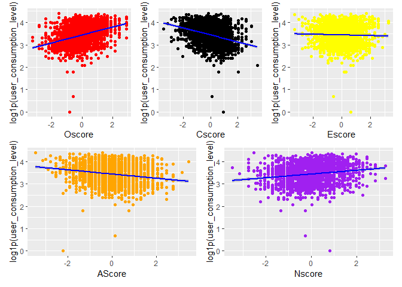<!-- -->

Again, across all the OCEAN personality traits, the significant
associations suggest that people who are more curious and entertain new
ideas (O score), less self-disciplined and diligent (C score), less
likely to be cooperative or kind (A score), and more likely to
experience emotions like anxiety or sadness (N score) may be more at
risk in regards to total drug consumption, both legal and illegal.

``` r
data_Impulsivity_1 = data_one |> dplyr::select(user_consumption_level, Impulsive)

plot_impulsivity <- ggplot(data_Impulsivity_1, aes(Impulsive, log1p(user_consumption_level))) + 
  geom_point(color = "cyan") +
  geom_smooth(method = "lm", se = TRUE, color = "blue")

model_Impulsivity <- lm(log1p(user_consumption_level) ~ Impulsive, data = data_Impulsivity_1)

data_SS_1 = data_one |> dplyr::select(user_consumption_level, SS)

plot_SS <- ggplot(data_SS_1, aes(SS, log1p(user_consumption_level))) + 
  geom_point(color = "green") +
  geom_smooth(method = "lm", se = TRUE, color = "blue")

model_SS <- lm(log1p(user_consumption_level) ~ SS, data = data_SS_1)

plot_patch_4 <- plot_impulsivity + plot_SS
plot_patch_4
```

    ## `geom_smooth()` using formula = 'y ~ x'

    ## Warning: Removed 8 rows containing non-finite outside the scale range
    ## (`stat_smooth()`).

    ## Warning: Removed 8 rows containing missing values or values outside the scale range
    ## (`geom_point()`).

    ## `geom_smooth()` using formula = 'y ~ x'

    ## Warning: Removed 8 rows containing non-finite outside the scale range (`stat_smooth()`).
    ## Removed 8 rows containing missing values or values outside the scale range
    ## (`geom_point()`).

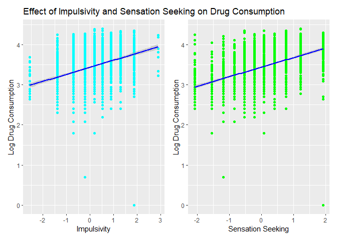<!-- -->

``` r
model_Impulsivity |> summary() |> broom::tidy() |>
  bind_rows(summary(model_SS) |> broom::tidy()) |>
  mutate(model = c("Impulsivity model", "Impulsivity model", "SS model", "SS model")) |>
  relocate(model) |>
  kbl(
    caption     = "Key Statistics for Prediction of Impulsivity and SS Scores from User Consumption"
    , col.names = c(
        "Model", "Predictor", "Estimate", "SE", "t-statistic", "p-value"
    )
    , digits    = c(3, 3, 3, 3, 3)
  )
```

<table>

<caption>

Key Statistics for Prediction of Impulsivity and SS Scores from User
Consumption
</caption>

<thead>

<tr>

<th style="text-align:left;">

Model
</th>

<th style="text-align:left;">

Predictor
</th>

<th style="text-align:right;">

Estimate
</th>

<th style="text-align:right;">

SE
</th>

<th style="text-align:right;">

t-statistic
</th>

<th style="text-align:right;">

p-value
</th>

</tr>

</thead>

<tbody>

<tr>

<td style="text-align:left;">

Impulsivity model
</td>

<td style="text-align:left;">

(Intercept)
</td>

<td style="text-align:right;">

3.435
</td>

<td style="text-align:right;">

0.010
</td>

<td style="text-align:right;">

342.844
</td>

<td style="text-align:right;">

0
</td>

</tr>

<tr>

<td style="text-align:left;">

Impulsivity model
</td>

<td style="text-align:left;">

Impulsive
</td>

<td style="text-align:right;">

0.176
</td>

<td style="text-align:right;">

0.011
</td>

<td style="text-align:right;">

16.753
</td>

<td style="text-align:right;">

0
</td>

</tr>

<tr>

<td style="text-align:left;">

SS model
</td>

<td style="text-align:left;">

(Intercept)
</td>

<td style="text-align:right;">

3.437
</td>

<td style="text-align:right;">

0.009
</td>

<td style="text-align:right;">

367.344
</td>

<td style="text-align:right;">

0
</td>

</tr>

<tr>

<td style="text-align:left;">

SS model
</td>

<td style="text-align:left;">

SS
</td>

<td style="text-align:right;">

0.238
</td>

<td style="text-align:right;">

0.010
</td>

<td style="text-align:right;">

24.412
</td>

<td style="text-align:right;">

0
</td>

</tr>

</tbody>

</table>

Likewise, the significant associations suggest that people who are more
impulsive and sensation-seeking may be more at risk in regards to total
drug consumption, both legal and illegal.

To take all of these personality traits into account for total drug
consumption, we developed 2 models. One model uses linear regression,
but doesn’t take any of the interactions between OCEAN trait scores,
impulsivity, and sensation seeking into account. The second model takes
all possible interactions into account.

The first table below displays the estimates of our personality trait
predictors without any interaction. It is notable that–in this
model–impulsivity has a p-value of 0.894, suggesting that the effects it
has on total drug consumption overlaps with other personality traits.

The second table is the results of comparing our two models through the
AIC test. Since the model with interaction between the personality
traits has a lower AIC score, it is tempting to conclude that taking
interaction into account is the better option.

For further testing, we compared key statistics such as R-squared
between the two models. Indeed, we observe that the interaction model
accounts for more of the variation in total drug consumption level
compared to the model with no interaction.

``` r
model_no_interaction_psychology <- lm(log1p(user_consumption_level) ~ Oscore + Cscore +
                                 AScore + Nscore + Impulsive + SS, data = data_one)

model_interaction_psychology <- lm(log1p(user_consumption_level) ~ (Oscore + Cscore +
                                 AScore + Nscore + Impulsive + SS)^6, data = data_one)

model_no_interaction_psychology |> summary() |>
  broom::tidy() |>
  kbl(
      caption     = "Effect of Psychological Predictors on Drug Consumption Levels"
    , col.names   = c("Predictor", "Estimate", "SE", "t-statistic", "p-value")
    , digits      = c(3, 3, 3, 3, 3)
  )
```

<table>

<caption>

Effect of Psychological Predictors on Drug Consumption Levels
</caption>

<thead>

<tr>

<th style="text-align:left;">

Predictor
</th>

<th style="text-align:right;">

Estimate
</th>

<th style="text-align:right;">

SE
</th>

<th style="text-align:right;">

t-statistic
</th>

<th style="text-align:right;">

p-value
</th>

</tr>

</thead>

<tbody>

<tr>

<td style="text-align:left;">

(Intercept)
</td>

<td style="text-align:right;">

3.437
</td>

<td style="text-align:right;">

0.009
</td>

<td style="text-align:right;">

393.577
</td>

<td style="text-align:right;">

0.000
</td>

</tr>

<tr>

<td style="text-align:left;">

Oscore
</td>

<td style="text-align:right;">

0.109
</td>

<td style="text-align:right;">

0.010
</td>

<td style="text-align:right;">

11.138
</td>

<td style="text-align:right;">

0.000
</td>

</tr>

<tr>

<td style="text-align:left;">

Cscore
</td>

<td style="text-align:right;">

-0.094
</td>

<td style="text-align:right;">

0.010
</td>

<td style="text-align:right;">

-9.333
</td>

<td style="text-align:right;">

0.000
</td>

</tr>

<tr>

<td style="text-align:left;">

AScore
</td>

<td style="text-align:right;">

-0.038
</td>

<td style="text-align:right;">

0.009
</td>

<td style="text-align:right;">

-4.026
</td>

<td style="text-align:right;">

0.000
</td>

</tr>

<tr>

<td style="text-align:left;">

Nscore
</td>

<td style="text-align:right;">

0.026
</td>

<td style="text-align:right;">

0.010
</td>

<td style="text-align:right;">

2.695
</td>

<td style="text-align:right;">

0.007
</td>

</tr>

<tr>

<td style="text-align:left;">

Impulsive
</td>

<td style="text-align:right;">

-0.002
</td>

<td style="text-align:right;">

0.012
</td>

<td style="text-align:right;">

-0.134
</td>

<td style="text-align:right;">

0.894
</td>

</tr>

<tr>

<td style="text-align:left;">

SS
</td>

<td style="text-align:right;">

0.159
</td>

<td style="text-align:right;">

0.012
</td>

<td style="text-align:right;">

12.770
</td>

<td style="text-align:right;">

0.000
</td>

</tr>

</tbody>

</table>

``` r
knitr::kable(AIC(model_no_interaction_psychology, model_interaction_psychology))
```

|                                 |  df |      AIC |
|:--------------------------------|----:|---------:|
| model_no_interaction_psychology |   8 | 1684.909 |
| model_interaction_psychology    |  65 | 1646.347 |

``` r
model_no_interaction_psychology |> summary() |> broom::glance() |>
  bind_rows(summary(model_interaction_psychology) |> broom::glance()) |>
  mutate(model = c("Psychology Model No Interaction", "Psychology Model with Interaction")) |>
  relocate(model) |>
  kbl(
    caption     = "Key Statistics for Prediction of User Consumption from Psychological Traits"
    , col.names = c(
        "Model", "R-squared", "Adj. R-squared"
      , "Sigma", "F-statistic", "p-value", "df", "Residual df", "N"
    )
    , digits    = c(1, 2, 2, 0, 2, 5, 0, 0, 0)
  )
```

<table>

<caption>

Key Statistics for Prediction of User Consumption from Psychological
Traits
</caption>

<thead>

<tr>

<th style="text-align:left;">

Model
</th>

<th style="text-align:right;">

R-squared
</th>

<th style="text-align:right;">

Adj. R-squared
</th>

<th style="text-align:right;">

Sigma
</th>

<th style="text-align:right;">

F-statistic
</th>

<th style="text-align:right;">

p-value
</th>

<th style="text-align:right;">

df
</th>

<th style="text-align:right;">

Residual df
</th>

<th style="text-align:right;">

N
</th>

</tr>

</thead>

<tbody>

<tr>

<td style="text-align:left;">

Psychology Model No Interaction
</td>

<td style="text-align:right;">

0.34
</td>

<td style="text-align:right;">

0.34
</td>

<td style="text-align:right;">

0
</td>

<td style="text-align:right;">

161.20
</td>

<td style="text-align:right;">

0
</td>

<td style="text-align:right;">

6
</td>

<td style="text-align:right;">

1869
</td>

<td style="text-align:right;">

1876
</td>

</tr>

<tr>

<td style="text-align:left;">

Psychology Model with Interaction
</td>

<td style="text-align:right;">

0.39
</td>

<td style="text-align:right;">

0.37
</td>

<td style="text-align:right;">

0
</td>

<td style="text-align:right;">

18.58
</td>

<td style="text-align:right;">

0
</td>

<td style="text-align:right;">

63
</td>

<td style="text-align:right;">

1812
</td>

<td style="text-align:right;">

1876
</td>

</tr>

</tbody>

</table>

``` r
model_interaction_psychology |> summary() |>
  broom::tidy() |>
  filter(p.value < 0.05) |>
  filter(term %in% c("Oscore", "Cscore", "AScore", "Nscore", "SS")) |>
  kbl(
      caption     = "Effect of Psychological Predictors on Drug Consumption Levels", 
      col.names   = c("Predictor", "Estimate", "SE", "t-statistic", "p-value"), 
      digits      = c(3, 3, 3, 3, 3)
  )
```

<table>

<caption>

Effect of Psychological Predictors on Drug Consumption Levels
</caption>

<thead>

<tr>

<th style="text-align:left;">

Predictor
</th>

<th style="text-align:right;">

Estimate
</th>

<th style="text-align:right;">

SE
</th>

<th style="text-align:right;">

t-statistic
</th>

<th style="text-align:right;">

p-value
</th>

</tr>

</thead>

<tbody>

<tr>

<td style="text-align:left;">

Oscore
</td>

<td style="text-align:right;">

0.120
</td>

<td style="text-align:right;">

0.012
</td>

<td style="text-align:right;">

10.015
</td>

<td style="text-align:right;">

0.000
</td>

</tr>

<tr>

<td style="text-align:left;">

Cscore
</td>

<td style="text-align:right;">

-0.115
</td>

<td style="text-align:right;">

0.012
</td>

<td style="text-align:right;">

-9.212
</td>

<td style="text-align:right;">

0.000
</td>

</tr>

<tr>

<td style="text-align:left;">

AScore
</td>

<td style="text-align:right;">

-0.058
</td>

<td style="text-align:right;">

0.012
</td>

<td style="text-align:right;">

-4.868
</td>

<td style="text-align:right;">

0.000
</td>

</tr>

<tr>

<td style="text-align:left;">

Nscore
</td>

<td style="text-align:right;">

0.031
</td>

<td style="text-align:right;">

0.012
</td>

<td style="text-align:right;">

2.558
</td>

<td style="text-align:right;">

0.011
</td>

</tr>

<tr>

<td style="text-align:left;">

SS
</td>

<td style="text-align:right;">

0.173
</td>

<td style="text-align:right;">

0.014
</td>

<td style="text-align:right;">

12.453
</td>

<td style="text-align:right;">

0.000
</td>

</tr>

</tbody>

</table>

Going forward, we will employ the linear model of total drug consumption
vs O score, C score, A score, N score, and sensation-seeking with
interaction as we take more variables into account. The parametric
estimates for each significant personality trait predictor is shown in
the table above.

To answer the original research question, while there is a significant
association between a person’s drug consumption level and their
personality traits, only 37 percent of this variation is accounted by
the personality traits. Thus, there is likely other factors that
contribute to a person’s consumption of drugs, legal and illegal.

To summarize the direction of the correlation between all of our
relevant variables–including OCEAN score, impulsivity,
sensation-seeking, and log of user drug consumption level– is displayed
in the following correlation heatmap.

``` r
data_one_transformed <- data_one |> mutate(log_user_consumption_level = log1p(user_consumption_level))

data_correlation = data_one_transformed |> select(Nscore, Escore, Oscore, AScore, Cscore, 
                                             Impulsive, SS, log_user_consumption_level) |>
  na.omit(log_user_consumption_level)

corr_mat <- round(cor(data_correlation), 3)
head(corr_mat)
```

    ##           Nscore Escore Oscore AScore Cscore Impulsive     SS
    ## Nscore     1.000 -0.431  0.008 -0.218 -0.392     0.173  0.078
    ## Escore    -0.431  1.000  0.245  0.158  0.308     0.114  0.208
    ## Oscore     0.008  0.245  1.000  0.037 -0.059     0.275  0.419
    ## AScore    -0.218  0.158  0.037  1.000  0.245    -0.230 -0.209
    ## Cscore    -0.392  0.308 -0.059  0.245  1.000    -0.336 -0.230
    ## Impulsive  0.173  0.114  0.275 -0.230 -0.336     1.000  0.623
    ##           log_user_consumption_level
    ## Nscore                         0.179
    ## Escore                        -0.032
    ## Oscore                         0.379
    ## AScore                        -0.202
    ## Cscore                        -0.331
    ## Impulsive                      0.361

``` r
corr_mat[upper.tri(corr_mat)] <- NA

melted_corr_mat <- melt(corr_mat)

p <- ggplot(data = melted_corr_mat, aes(x = Var1, y = Var2, fill = value)) +
  geom_tile() +
  geom_text(aes(Var1, Var2, label = value, color = "black", size = 4))

p
```

    ## Warning: Removed 28 rows containing missing values or values outside the scale range
    ## (`geom_text()`).

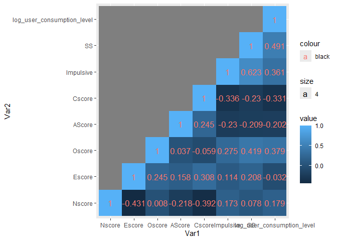<!-- -->

# Education

To test whether there is a significant relationship between a person’s
education status and their consumption of drugs, we decided to create a
variable in the data that counted how many drugs a person uses. We
classified this as an ordinal variable in terms of severity. Thus, this
relationship’s significance is shown in the following chi-squared test.

``` r
data_five <- data_one |> group_by(Education, user_status) |> summarize(count = n()) |>
  na.omit(Education)
```

    ## `summarise()` has grouped output by 'Education'. You can override using the
    ## `.groups` argument.

``` r
data_six <- data_five |> pivot_wider(
  names_from = user_status,
  values_from = count,
  values_fill = 0
)

chi_test_result_education <- chisq.test(data_six[ , -1])
```

    ## Warning in chisq.test(data_six[, -1]): Chi-squared approximation may be
    ## incorrect

``` r
tidy_chi_test_result_education <- tidy(chi_test_result_education)

chi_square_education_summary <- data.frame(
  Statistic = c("Chi-squared", "Degrees of Freedom", "P-Value"),
  Value = c(round(tidy_chi_test_result_education$statistic, 2),
            round(tidy_chi_test_result_education$parameter, 2),
            round(tidy_chi_test_result_education$p.value, 3)
            )
)

kable(chi_square_education_summary)
```

|           | Statistic          |  Value |
|:----------|:-------------------|-------:|
| X-squared | Chi-squared        | 396.24 |
| df        | Degrees of Freedom | 144.00 |
|           | P-Value            |   0.00 |

Since our chi-squared test resulted in a p-value of near 0, we can
conclude that there is a significant relationship between a person’s
education status and their drug consumption level, and that these two
variables are not independent.

To examine the direction of this relationship, we decided to plot out
the distribution of total drug consumption level for each level of
education in box-plots. This plot can be seen below.

``` r
data_education <- data_one |> mutate(Education = factor(Education, levels = c("Left school before 16 years", "Left school at 16 years", "Left school at 17 years", "Left school at 18 years",
                                                  "Some college or university, no certificate or degree",
                                                  "University degree", "Masters degree",
                                                  "Professional certificate/ diploma", "Doctorate degree"))) |>
  arrange(Education)

plot_education <- data_education |> ggplot(aes(x = Education, y = log1p(user_consumption_level), fill = Education)) +
  geom_boxplot() +
  labs(title = "Log of User Consumption Dependent on Education",
       x = "Education",
       y = "Log User Consumption Level") +
  theme_minimal() + 
  theme(axis.text.x = element_blank())

plot_education
```

    ## Warning: Removed 8 rows containing non-finite outside the scale range
    ## (`stat_boxplot()`).

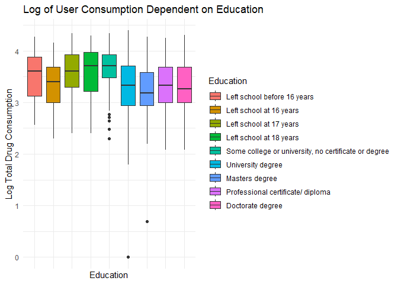<!-- -->

It is notable that as a person’s education goes up from “left school
before 16 years” to “some college or university, but no certificate or
degree,” a person’s total drug consumption level increases on average.
However, from that point on, as education status goes up, the level of
total drug consumption level generally decreases.

Furthermore, to analyze the relationship between education status and
our relevant personality traits, we conducted ANOVA test to see if the
mean traits of O score, C score, A score, N score, and Sensation-Seeking
differed among at least 2 of our education groups. The results of the
ANOVA tests are summarized below.

``` r
data_Oscore_Education_prime <- data_education |> select(Education, Oscore)
Oscore_aov_education_model <- aov(Oscore~Education, data = data_Oscore_Education_prime)
tidy_anova_Oscore <- tidy(Oscore_aov_education_model) |> mutate(model = "O score education")

data_Cscore_Education_prime <- data_education |> select(Education, Cscore)
Cscore_aov_education_model <- aov(Cscore~Education, data = data_Cscore_Education_prime)
tidy_anova_Cscore <- tidy(Cscore_aov_education_model) |> mutate(model = "C score education")

data_Ascore_Education_prime <- data_education |> select(Education, AScore)
Ascore_aov_education_model <- aov(AScore~Education, data = data_Ascore_Education_prime)
tidy_anova_Ascore <- tidy(Ascore_aov_education_model) |> mutate(model = "O score education")

data_Nscore_Education_prime <- data_education |> select(Education, Nscore)
Nscore_aov_education_model <- aov(Nscore~Education, data = data_Nscore_Education_prime)
tidy_anova_Nscore <- tidy(Nscore_aov_education_model) |> mutate(model = "N score education")

data_SS_Education_prime <- data_education |> select(Education, SS)
SS_aov_education_model <- aov(SS~Education, data = data_SS_Education_prime)
tidy_anova_SS <- tidy(SS_aov_education_model) |> mutate(model = "SS education")


kable(bind_rows(tidy_anova_Oscore, tidy_anova_Cscore, tidy_anova_Ascore, tidy_anova_Nscore, tidy_anova_SS))
```

| term      |   df |      sumsq |     meansq | statistic |  p.value | model             |
|:----------|-----:|-----------:|-----------:|----------:|---------:|:------------------|
| Education |    8 |  121.32548 | 15.1656851 | 16.266137 | 0.00e+00 | O score education |
| Residuals | 1875 | 1748.15070 |  0.9323470 |        NA |       NA | O score education |
| Education |    8 |  163.21359 | 20.4016983 | 22.351158 | 0.00e+00 | C score education |
| Residuals | 1875 | 1711.46320 |  0.9127804 |        NA |       NA | C score education |
| Education |    8 |   26.61024 |  3.3262806 |  3.376858 | 7.46e-04 | O score education |
| Residuals | 1875 | 1846.91701 |  0.9850224 |        NA |       NA | O score education |
| Education |    8 |   34.11085 |  4.2638564 |  4.338687 | 3.37e-05 | N score education |
| Residuals | 1875 | 1842.66116 |  0.9827526 |        NA |       NA | N score education |
| Education |    8 |  111.51425 | 13.9392816 | 15.967770 | 0.00e+00 | SS education      |
| Residuals | 1875 | 1636.80673 |  0.8729636 |        NA |       NA | SS education      |

From our ANOVA table, it is observed that all the tests yielded p-values
of near 0. Thus, we can conclude that the O trait, C trait, A trait, N
trait, and sensation-seeking traits differ significantly between at
least 2 education groups for each trait. To further examine the specific
differences, we plotted the distribution of all trait scores for each
education status below.

``` r
plot_Education_Oscore <- data_Oscore_Education_prime |> ggplot(aes(x = Education, 
                              y = Oscore, fill = Education)) + geom_boxplot() + 
  theme(axis.text.x = element_blank())
plot_Education_Cscore <- data_Cscore_Education_prime |> ggplot(aes(x = Education, y = Cscore, fill = Education)) + geom_boxplot() +
  theme(axis.text.x = element_blank())
plot_Education_Ascore <- data_Ascore_Education_prime |> ggplot(aes(x = Education, y = AScore, fill = Education)) + geom_boxplot() +
  theme(axis.text.x = element_blank())
plot_Education_Nscore <- data_Nscore_Education_prime |> ggplot(aes(x = Education, y = Nscore, fill = Education)) + geom_boxplot() +
  theme(axis.text.x = element_blank())
plot_Education_SS <- data_SS_Education_prime |> ggplot(aes(x = Education, y = SS, fill = Education)) + geom_boxplot() +
  theme(axis.text.x = element_blank())

plot_education_patch <- ggarrange(plot_Education_Oscore, plot_Education_Cscore, plot_Education_Ascore,
                                  plot_Education_Nscore, plot_Education_SS, ncol = 3, 
                                  nrow = 2, common.legend = TRUE, legend = "bottom")

plot_education_patch
```

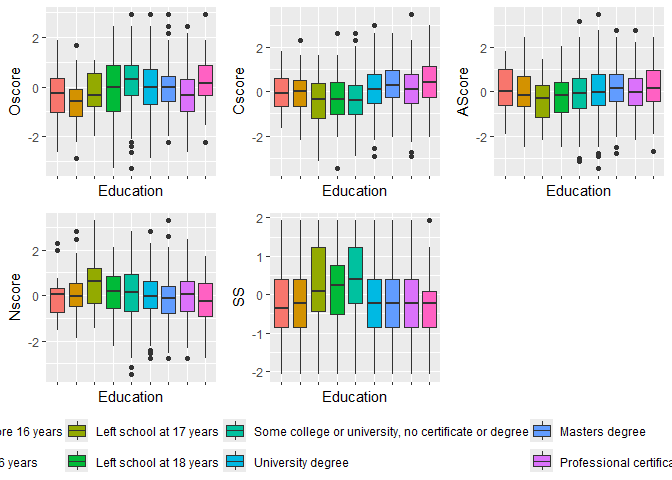<!-- -->

By examining the O-score distribution, it seems that the group most
at-risk of a high curiosity are those with some college or university
experience, but no certificate or degree. Likewise, for the C-score
trait, the same group also has the lowest mean score for organization
and diligence. For the sensation-seeking trait, those who left school at
18 years are also very likely to have a high score on average. For
agreeableness (A score) and neuroticism (N score), those who left school
at 17 years are most at risk of having the lowest and highest scores on
average, respectively.

# Country

To test a relationship between drug consumption and a user’s country of
residence, a similar procedure to the chi-squared test for education was
used. The results of the chi-squared test are shown below.

``` r
data_country <- data_one |> group_by(Country, user_status_real) |> summarize(count = n()) |>
  na.omit(user_status_real)
```

    ## `summarise()` has grouped output by 'Country'. You can override using the
    ## `.groups` argument.

``` r
data_country_prime <- data_country |> pivot_wider(
  names_from = user_status_real,
  values_from = count,
  values_fill = 0
)

chi_test_result_residence <- chisq.test(data_country_prime[ , -1])
```

    ## Warning in chisq.test(data_country_prime[, -1]): Chi-squared approximation may
    ## be incorrect

``` r
tidy_chi_test_result_residence <- tidy(chi_test_result_residence)

chi_square_residence_summary <- data.frame(
  Statistic = c("Chi-squared", "Degrees of Freedom", "P-Value"),
  Value = c(round(tidy_chi_test_result_residence$statistic, 2),
            round(tidy_chi_test_result_residence$parameter, 2),
            round(tidy_chi_test_result_residence$p.value, 3)
            )
)

kable(chi_square_residence_summary)
```

|           | Statistic          |  Value |
|:----------|:-------------------|-------:|
| X-squared | Chi-squared        | 707.26 |
| df        | Degrees of Freedom | 108.00 |
|           | P-Value            |   0.00 |

After determining a significant relationship, we examined the
distribution of the log of total drug consumption and how that changed
for each country.

The most notable result from our analysis is that if a user resides in
the country of UK, they are likely to have a lower level of total drug
consumption compared to other countries. Meanwhile, the users with the
highest level of drug consumption on average are those that reside in
the U.S.A.

``` r
data_one_trans <- data_one |> mutate(log_user_consumption_level = log1p(user_consumption_level))

data_one_trans |> ggplot(aes(x = Country, y = log_user_consumption_level, fill = Country)) + geom_boxplot()
```

    ## Warning: Removed 8 rows containing non-finite outside the scale range
    ## (`stat_boxplot()`).

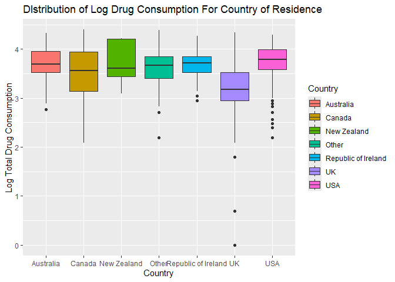<!-- -->

To determine the reason for this discrepancy, we examined the
distribution of a user’s OCEAN scores, impulsivity and sensation-seeking
fo each country.

For traits that negatively impact a user’s drug consumption, the U.S.A.
was often the highest in terms of the mean traits. For example, in terms
of openness and curiosity, it is shown that the U.S.A. has a higher
trait score on average. Along the same direction, for traits such as
agreeableness or conscientiousness that would positively improve a
user’s level of total drug consumption, the U.S.A. often ranked the
lowest among the countries on average.

In contrast, the U.K. often ranks the highest in positive traits and the
lowest in negative traits. The difference in extraversion for these
countries were not considered strongly, since there isn’t a significant
association between said trait and total drug consumption.

``` r
data_Oscore_country <- data_one |> select(Country, Oscore)
Oscore_aov_country_model <- aov(Oscore~Country, data = data_Oscore_country)
tidy_anova_Oscore_country <- tidy(Oscore_aov_country_model) |> mutate(model = "O score country")
p1 <- data_Oscore_country |> ggplot(aes(x = Country, y = Oscore, fill = Country)) + geom_boxplot() +
  theme(axis.text.x = element_blank())

data_Cscore_country <- data_one |> select(Country, Cscore)
Cscore_aov_country_model <- aov(Cscore~Country, data = data_Cscore_country)
tidy_anova_Cscore_country <- tidy(Cscore_aov_country_model) |> mutate(model = "C score country")
p2 <- data_Cscore_country |> ggplot(aes(x = Country, y = Cscore, fill = Country)) + geom_boxplot() +
  theme(axis.text.x = element_blank())

data_Escore_country <- data_one |> select(Country, Escore)
Escore_aov_country_model <- aov(Escore~Country, data = data_Escore_country)
tidy_anova_Escore_country <- tidy(Escore_aov_country_model) |> mutate(model = "E score country")
p3 <- data_Escore_country |> ggplot(aes(x = Country, y = Escore, fill = Country)) + geom_boxplot() +
  theme(axis.text.x = element_blank())

data_Ascore_country <- data_one |> select(Country, AScore)
Ascore_aov_country_model <- aov(AScore~Country, data = data_Ascore_country)
tidy_anova_Ascore_country <- tidy(Ascore_aov_country_model) |> mutate(model = "A score country")
p4 <- data_Ascore_country |> ggplot(aes(x = Country, y = AScore, fill = Country)) + geom_boxplot() +
  theme(axis.text.x = element_blank())

data_Nscore_country <- data_one |> select(Country, Nscore)
Nscore_aov_country_model <- aov(Nscore~Country, data = data_Nscore_country)
tidy_anova_Nscore_country <- tidy(Nscore_aov_country_model) |> mutate(model = "N score country")
p5 <- data_Nscore_country |> ggplot(aes(x = Country, y = Nscore, fill = Country)) + geom_boxplot() +
  theme(axis.text.x = element_blank())

data_Impulsivity_country <- data_one |> select(Country, Impulsive)
Impulsivity_aov_country_model <- aov(Impulsive~Country, data = data_Impulsivity_country)
tidy_anova_Impulsivity_country <- tidy(Impulsivity_aov_country_model) |> mutate(model = "Impulsivity score country")
p6 <- data_Impulsivity_country |> ggplot(aes(x = Country, y = Impulsive, fill = Country)) + geom_boxplot() +
  theme(axis.text.x = element_blank())

data_SS_country <- data_one |> select(Country, SS)
SS_aov_country_model <- aov(SS~Country, data = data_SS_country)
tidy_anova_SS_country <- tidy(SS_aov_country_model) |> mutate(model = "N score country")
p7 <- data_SS_country |> ggplot(aes(x = Country, y = SS, fill = Country)) + geom_boxplot() +
  theme(axis.text.x = element_blank())

kable(bind_rows(tidy_anova_Oscore_country, tidy_anova_Cscore_country, 
                tidy_anova_Escore_country, tidy_anova_Ascore_country, 
                tidy_anova_Nscore_country))
```

| term      |   df |      sumsq |     meansq | statistic |  p.value | model           |
|:----------|-----:|-----------:|-----------:|----------:|---------:|:----------------|
| Country   |    6 |  221.16396 | 36.8606597 | 41.974729 | 0.00e+00 | O score country |
| Residuals | 1877 | 1648.31222 |  0.8781631 |        NA |       NA | O score country |
| Country   |    6 |   90.06932 | 15.0115525 | 15.788729 | 0.00e+00 | C score country |
| Residuals | 1877 | 1784.60747 |  0.9507765 |        NA |       NA | C score country |
| Country   |    6 |   30.92140 |  5.1535672 |  5.248226 | 2.26e-05 | E score country |
| Residuals | 1877 | 1843.14566 |  0.9819636 |        NA |       NA | E score country |
| Country   |    6 |   54.12981 |  9.0216357 |  9.307263 | 0.00e+00 | A score country |
| Residuals | 1877 | 1819.39744 |  0.9693114 |        NA |       NA | A score country |
| Country   |    6 |   42.74903 |  7.1248382 |  7.291796 | 1.00e-07 | N score country |
| Residuals | 1877 | 1834.02299 |  0.9771033 |        NA |       NA | N score country |

``` r
plot_country_psychology_patch <- ggarrange(p1, p2, p3,
                                  p4, p5, ncol = 3, 
                                  nrow = 2, common.legend = TRUE, legend = "right")

plot_country_psychology_patch
```

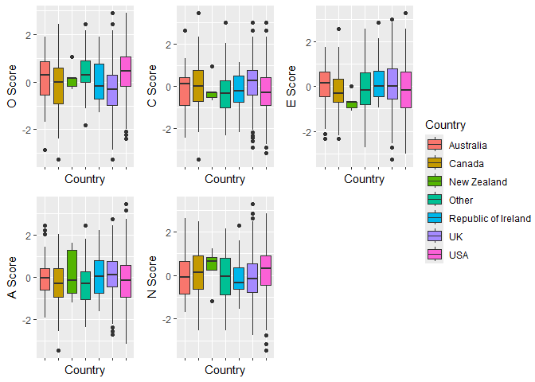<!-- -->

``` r
kable(bind_rows(tidy_anova_Impulsivity_country, tidy_anova_SS_country))
```

| term | df | sumsq | meansq | statistic | p.value | model |
|:---|---:|---:|---:|---:|---:|:---|
| Country | 6 | 95.87967 | 15.9799458 | 18.51171 | 0 | Impulsivity score country |
| Residuals | 1877 | 1620.29080 | 0.8632343 | NA | NA | Impulsivity score country |
| Country | 6 | 210.95916 | 35.1598592 | 42.92747 | 0 | N score country |
| Residuals | 1877 | 1537.36182 | 0.8190527 | NA | NA | N score country |

``` r
plot_country_psychology_patch_2 <- ggarrange(p6, p7, ncol = 2, 
                                  nrow = 1, common.legend = TRUE, legend = "right")

plot_country_psychology_patch_2
```

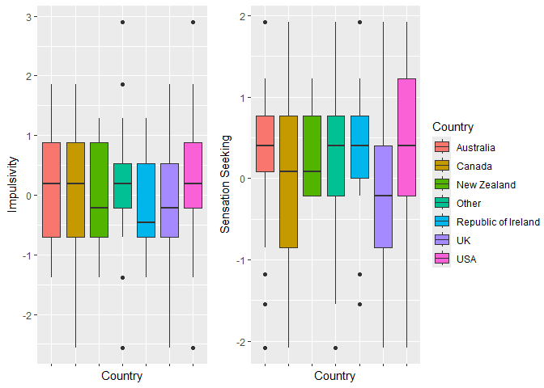<!-- -->

To examine if there was also a relationship between the country of
residence and a user’s education, seven histograms were produced to
examine the distribution of education status.

Specifically, the UK has a distribution for education that is skewed
toward the lower levels, meaning a person is more likely to have a
university degree or above. Meanwhile, the education level in the U.S.A.
is heavily concentrated in those who have some college or university
experience but no degree. This is the education level that was
identified as a possible population at risk due to its average OCEAN,
impulsivity and sensation-seeking trait scores.

``` r
data_education |> ggplot(aes(x = Education, fill = Education)) + geom_bar() +
  facet_wrap(~Country) + theme(axis.text.x = element_blank())
```

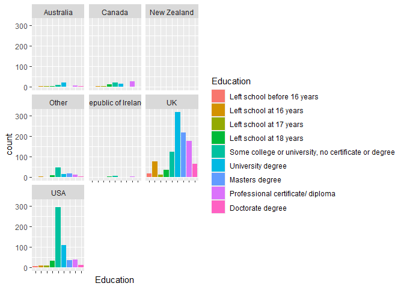<!-- -->

# Model with Psychological Traits, Education, and Residence

``` r
model_no_interaction_education_residence <- lm(log1p(user_consumption_level) ~ (Oscore * Cscore *
                                 AScore * Nscore * SS) + Country + Education, data = data_one)

model_no_interaction_education_residence |> summary() |>
  broom::tidy() |>
  filter(p.value < 0.05) |>
  filter(term %in% c("CountryCanada", "CountryOther", "CountryUK",
                     "EducationLeft school at 18 years",
                     "EducationLeft school before 16 years",
                     "EducationSome college or university, no certificate or degree")) |>
  kbl(
      caption     = "Effect of Relevant Environmental Predictors on Drug Consumption Levels", 
      col.names   = c("Predictor", "Estimate", "SE", "t-statistic", "p-value"), 
      digits      = c(3, 3, 3, 3, 3)
  )
```

<table>

<caption>

Effect of Relevant Environmental Predictors on Drug Consumption Levels
</caption>

<thead>

<tr>

<th style="text-align:left;">

Predictor
</th>

<th style="text-align:right;">

Estimate
</th>

<th style="text-align:right;">

SE
</th>

<th style="text-align:right;">

t-statistic
</th>

<th style="text-align:right;">

p-value
</th>

</tr>

</thead>

<tbody>

<tr>

<td style="text-align:left;">

CountryCanada
</td>

<td style="text-align:right;">

-0.127
</td>

<td style="text-align:right;">

0.061
</td>

<td style="text-align:right;">

-2.062
</td>

<td style="text-align:right;">

0.039
</td>

</tr>

<tr>

<td style="text-align:left;">

CountryOther
</td>

<td style="text-align:right;">

-0.148
</td>

<td style="text-align:right;">

0.059
</td>

<td style="text-align:right;">

-2.522
</td>

<td style="text-align:right;">

0.012
</td>

</tr>

<tr>

<td style="text-align:left;">

CountryUK
</td>

<td style="text-align:right;">

-0.304
</td>

<td style="text-align:right;">

0.050
</td>

<td style="text-align:right;">

-6.069
</td>

<td style="text-align:right;">

0.000
</td>

</tr>

<tr>

<td style="text-align:left;">

EducationLeft school at 18 years
</td>

<td style="text-align:right;">

0.149
</td>

<td style="text-align:right;">

0.052
</td>

<td style="text-align:right;">

2.856
</td>

<td style="text-align:right;">

0.004
</td>

</tr>

<tr>

<td style="text-align:left;">

EducationLeft school before 16 years
</td>

<td style="text-align:right;">

0.217
</td>

<td style="text-align:right;">

0.076
</td>

<td style="text-align:right;">

2.859
</td>

<td style="text-align:right;">

0.004
</td>

</tr>

<tr>

<td style="text-align:left;">

EducationSome college or university, no certificate or degree
</td>

<td style="text-align:right;">

0.110
</td>

<td style="text-align:right;">

0.042
</td>

<td style="text-align:right;">

2.616
</td>

<td style="text-align:right;">

0.009
</td>

</tr>

</tbody>

</table>

``` r
model_interaction_psychology |> summary() |> broom::glance() |>
  bind_rows(summary(model_no_interaction_education_residence) |> broom::glance()) |>
  mutate(model = c("Psychology Model with Personality Traits", "Psychology Model with Personality Traits, 
                   Education and Residence")) |>
  relocate(model) |>
  kbl(
    caption     = "Key Statistics for Prediction of User Consumption from Psychological Traits 
    and Environmental Factors"
    , col.names = c(
        "Model", "R-squared", "Adj. R-squared"
      , "Sigma", "F-statistic", "p-value", "df", "Residual df", "N"
    )
    , digits    = c(1, 2, 2, 0, 2, 5, 0, 0, 0)
  )
```

<table>

<caption>

Key Statistics for Prediction of User Consumption from Psychological
Traits and Environmental Factors
</caption>

<thead>

<tr>

<th style="text-align:left;">

Model
</th>

<th style="text-align:right;">

R-squared
</th>

<th style="text-align:right;">

Adj. R-squared
</th>

<th style="text-align:right;">

Sigma
</th>

<th style="text-align:right;">

F-statistic
</th>

<th style="text-align:right;">

p-value
</th>

<th style="text-align:right;">

df
</th>

<th style="text-align:right;">

Residual df
</th>

<th style="text-align:right;">

N
</th>

</tr>

</thead>

<tbody>

<tr>

<td style="text-align:left;">

Psychology Model with Personality Traits
</td>

<td style="text-align:right;">

0.39
</td>

<td style="text-align:right;">

0.37
</td>

<td style="text-align:right;">

0
</td>

<td style="text-align:right;">

18.58
</td>

<td style="text-align:right;">

0
</td>

<td style="text-align:right;">

63
</td>

<td style="text-align:right;">

1812
</td>

<td style="text-align:right;">

1876
</td>

</tr>

<tr>

<td style="text-align:left;">

Psychology Model with Personality Traits, Education and Residence
</td>

<td style="text-align:right;">

0.47
</td>

<td style="text-align:right;">

0.45
</td>

<td style="text-align:right;">

0
</td>

<td style="text-align:right;">

35.35
</td>

<td style="text-align:right;">

0
</td>

<td style="text-align:right;">

45
</td>

<td style="text-align:right;">

1830
</td>

<td style="text-align:right;">

1876
</td>

</tr>

</tbody>

</table>

``` r
knitr::kable(AIC(model_interaction_psychology, model_no_interaction_education_residence))
```

|                                          |  df |      AIC |
|:-----------------------------------------|----:|---------:|
| model_interaction_psychology             |  65 | 1646.347 |
| model_no_interaction_education_residence |  47 | 1371.758 |

# Gender on Drug Consumption

We also explore other variables that could contribute to a person’s drug
consumption. To analyze if the true user drug consumption was the same
or different between the two genders, we conducted a two-sample t-test.

``` r
t_test_result <- t.test(user_consumption_level~Gender, data = data_one, var.equaql = FALSE, alternative = "two.sided")
print(t_test_result)
```

    ## 
    ##  Welch Two Sample t-test
    ## 
    ## data:  user_consumption_level by Gender
    ## t = -15.014, df = 1839, p-value < 2.2e-16
    ## alternative hypothesis: true difference in means between group F and group M is not equal to 0
    ## 95 percent confidence interval:
    ##  -11.090030  -8.527473
    ## sample estimates:
    ## mean in group F mean in group M 
    ##        28.44338        38.25213

``` r
data_one |> ggplot(aes(x = Gender, y = user_consumption_level, fill = Gender)) + geom_boxplot()
```

    ## Warning: Removed 8 rows containing non-finite outside the scale range
    ## (`stat_boxplot()`).

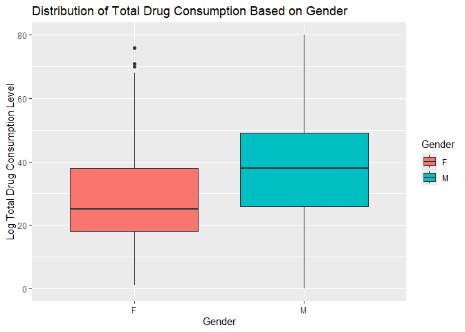<!-- -->

Because the p-value of our t-test was again near 0, we can conclude that
there is a significant difference in the true average drug consumption
level between the male and female genders.

To examine this difference, we plotted their respective distributions in
the boxplot graph. The general trend is that male users have a higher
drug consumption level on average compared to female users. There is
also more variation in the log of user consumption level as compared to
female users.

# Ethnicity on Drug Consumption

A similar procedure to the chi-squared tests for ethnicity and country
of residence was carried out to examine if there is a relationship
between drug consumption and a user’s ethnicity.

``` r
data_ethnicity <- data_one |> group_by(Ethnicity, user_status_real) |> summarize(count = n()) |>
  na.omit(user_status_real)
```

    ## `summarise()` has grouped output by 'Ethnicity'. You can override using the
    ## `.groups` argument.

``` r
data_ethnicity_prime <- data_ethnicity |> pivot_wider(
  names_from = user_status_real,
  values_from = count,
  values_fill = 0
)

chi_test_result_ethnicity <- chisq.test(data_ethnicity_prime[ , -1])
```

    ## Warning in chisq.test(data_ethnicity_prime[, -1]): Chi-squared approximation
    ## may be incorrect

``` r
tidy_chi_test_result_ethnicity <- tidy(chi_test_result_ethnicity)

chi_square_ethnicity_summary <- data.frame(
  Statistic = c("Chi-squared", "Degrees of Freedom", "P-Value"),
  Value = c(round(tidy_chi_test_result_ethnicity$statistic, 2),
            round(tidy_chi_test_result_ethnicity$parameter, 2),
            round(tidy_chi_test_result_ethnicity$p.value, 3)
            )
)

kable(chi_square_ethnicity_summary)
```

|           | Statistic          |  Value |
|:----------|:-------------------|-------:|
| X-squared | Chi-squared        | 292.64 |
| df        | Degrees of Freedom | 108.00 |
|           | P-Value            |   0.00 |

After determining a significant relationship due to the p-value of near
0, we then plotted the distribution of a user’s consumption level in
regard to their ethnicity.

On average, we determined that Mixed-Black/Asian, Mixed-White/Asian, and
“Other” ethnicity have the highest log total drug consumption on average
compared to other ethnicity. It is also notable that White also has a
fairly higher log total drug consumption when compared to the Black and
Asian ethnicity.

``` r
data_one_trans |> ggplot(aes(x = Ethnicity, y = log_user_consumption_level, fill = Ethnicity)) + geom_boxplot()
```

    ## Warning: Removed 8 rows containing non-finite outside the scale range
    ## (`stat_boxplot()`).

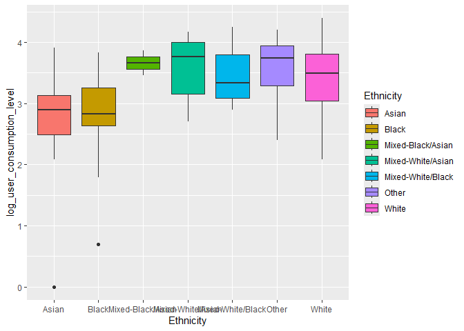<!-- -->

To this end, we also examined if there is a significant relationship
between a user’s ethnicity and a user’s country of residence using a
chi-squared statistical test. Because the p-value is near 0, we
determined that there is a significant association between the two
variables, which influenced our decision to take their interaction into
account later in our linear model building.

``` r
data_ethnicity_country <- data_one |> group_by(Country, Ethnicity) |> summarize(count = n())
```

    ## `summarise()` has grouped output by 'Country'. You can override using the
    ## `.groups` argument.

``` r
data_ethnicity_country_prime <- data_ethnicity_country |> pivot_wider(
  names_from = Ethnicity,
  values_from = count,
  values_fill = 0
)

chi_test_result_ethnicity_country <- chisq.test(data_ethnicity_country_prime[ , -1])
```

    ## Warning in chisq.test(data_ethnicity_country_prime[, -1]): Chi-squared
    ## approximation may be incorrect

``` r
tidy_chi_test_result_ethnicity_country <- tidy(chi_test_result_ethnicity_country)

chi_square_ethnicity_country_summary <- data.frame(
  Statistic = c("Chi-squared", "Degrees of Freedom", "P-Value"),
  Value = c(round(tidy_chi_test_result_ethnicity_country$statistic, 2),
            round(tidy_chi_test_result_ethnicity_country$parameter, 2),
            round(tidy_chi_test_result_ethnicity_country$p.value, 3)
            )
)

kable(chi_square_ethnicity_country_summary)
```

|           | Statistic          |  Value |
|:----------|:-------------------|-------:|
| X-squared | Chi-squared        | 67.720 |
| df        | Degrees of Freedom | 36.000 |
|           | P-Value            |  0.001 |

# Age and Drug Consumption

``` r
data_age <- data_one |> group_by(Age, user_status_real) |> summarize(count = n()) |>
  na.omit(user_status_real)
```

    ## `summarise()` has grouped output by 'Age'. You can override using the `.groups`
    ## argument.

``` r
data_age_prime <- data_age |> pivot_wider(
  names_from = user_status_real,
  values_from = count,
  values_fill = 0
)

chi_test_result_age <- chisq.test(data_age_prime[ , -1])
```

    ## Warning in chisq.test(data_age_prime[, -1]): Chi-squared approximation may be
    ## incorrect

``` r
print(chi_test_result_age)
```

    ## 
    ##  Pearson's Chi-squared test
    ## 
    ## data:  data_age_prime[, -1]
    ## X-squared = 540.9, df = 90, p-value < 2.2e-16

After conducting a chi-squared test, we determined a significant
relationship between a user’s age and their total drug consumption
level. Below is a distribution of said user’s log consumption and their
respective age group.

``` r
data_one_trans |> ggplot(aes(x = Age, y = log_user_consumption_level, fill = Age)) + geom_boxplot()
```

    ## Warning: Removed 8 rows containing non-finite outside the scale range
    ## (`stat_boxplot()`).

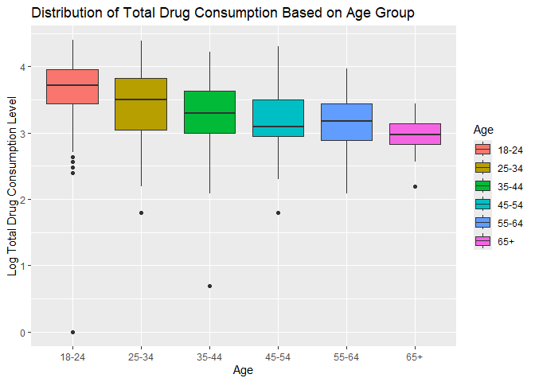<!-- -->

We see that those who are aged 18 to 24 are generally more at risk in
regards to having a higher log drug consumption. This motivated us to
determine if there was any correlation between age groups and other
variables such as Education.

``` r
data_age_education <- data_one |> group_by(Age, Education) |> summarize(count = n()) |>
  na.omit(Education)
```

    ## `summarise()` has grouped output by 'Age'. You can override using the `.groups`
    ## argument.

``` r
data_age_education_prime <- data_age_education |> pivot_wider(
  names_from = Education,
  values_from = count,
  values_fill = 0
)

chi_test_result_age_education <- chisq.test(data_age_education_prime[ , -1])
```

    ## Warning in chisq.test(data_age_education_prime[, -1]): Chi-squared
    ## approximation may be incorrect

``` r
tidy_chi_test_result_age_education <- tidy(chi_test_result_age_education)

chi_square_age_education_summary <- data.frame(
  Statistic = c("Chi-squared", "Degrees of Freedom", "P-Value"),
  Value = c(round(tidy_chi_test_result_age_education$statistic, 2),
            round(tidy_chi_test_result_age_education$parameter, 2),
            round(tidy_chi_test_result_age_education$p.value, 3)
            )
)

kable(chi_square_age_education_summary)
```

|           | Statistic          |  Value |
|:----------|:-------------------|-------:|
| X-squared | Chi-squared        | 532.93 |
| df        | Degrees of Freedom |  40.00 |
|           | P-Value            |   0.00 |

After determining a significant association between age group and
education from the chi-squared test above, we plotted the distribution
of age for each education level. We see that for the education level of
some college or university, the data is skewed extremely towards the
right.

This suggests that age 18-24 are also most likely attending college or
university, the education group most at risk. Below are all the
distributions for age groups among each education level.

``` r
data_education |> ggplot(aes(x = Age, fill = Age)) + geom_bar() +
  facet_wrap(~Education) + theme(axis.text.x = element_blank())
```

<!-- -->

Finally, in regards to age-groups and personality traits, we conducted
an ANOVA test for each relevant personality trait. The results are
compiled in the table below.

``` r
data_Oscore_age <- data_one |> select(Age, Oscore)
Oscore_aov_age_model <- aov(Oscore~Age, data = data_Oscore_age)
tidy_anova_Oscore_age <- tidy(Oscore_aov_age_model) |> mutate(model = "O score Age")
pp1 <- data_Oscore_age |> ggplot(aes(x = Age, y = Oscore, fill = Age)) + geom_boxplot() +
  theme(axis.text.x = element_blank())

data_Cscore_age <- data_one |> select(Age, Cscore)
Cscore_aov_age_model <- aov(Cscore~Age, data = data_Cscore_age)
tidy_anova_Cscore_age <- tidy(Cscore_aov_age_model) |> mutate(model = "C score Age")
pp2 <- data_Cscore_age |> ggplot(aes(x = Age, y = Cscore, fill = Age)) + geom_boxplot() +
  theme(axis.text.x = element_blank())

data_Ascore_age <- data_one |> select(Age, AScore)
Ascore_aov_age_model <- aov(AScore~Age, data = data_Ascore_age)
tidy_anova_Ascore_age <- tidy(Ascore_aov_age_model) |> mutate(model = "A score Age")
pp3 <- data_Ascore_age |> ggplot(aes(x = Age, y = AScore, fill = Age)) + geom_boxplot() +
  theme(axis.text.x = element_blank())

data_Nscore_age <- data_one |> select(Age, Nscore)
Nscore_aov_age_model <- aov(Nscore~Age, data = data_Nscore_age)
tidy_anova_Nscore_age <- tidy(Nscore_aov_age_model) |> mutate(model = "N score Age")
pp4 <- data_Nscore_age |> ggplot(aes(x = Age, y = Nscore, fill = Age)) + geom_boxplot() +
  theme(axis.text.x = element_blank())

data_SS_age <- data_one |> select(Age, SS)
SS_aov_age_model <- aov(SS~Age, data = data_SS_age)
tidy_anova_SS_age <- tidy(SS_aov_age_model) |> mutate(model = "SS score Age")
pp5 <- data_SS_age |> ggplot(aes(x = Age, y = SS, fill = Age)) + geom_boxplot() +
  theme(axis.text.x = element_blank())

kable(bind_rows(tidy_anova_Oscore_age, tidy_anova_Cscore_age, tidy_anova_Ascore_age,
                tidy_anova_Nscore_age, tidy_anova_SS_age))
```

| term      |   df |      sumsq |     meansq | statistic |   p.value | model        |
|:----------|-----:|-----------:|-----------:|----------:|----------:|:-------------|
| Age       |    5 |  115.76147 | 23.1522942 | 24.793091 | 0.0000000 | O score Age  |
| Residuals | 1878 | 1753.71471 |  0.9338204 |        NA |        NA | O score Age  |
| Age       |    5 |   75.19042 | 15.0380845 | 15.694213 | 0.0000000 | C score Age  |
| Residuals | 1878 | 1799.48636 |  0.9581930 |        NA |        NA | C score Age  |
| Age       |    5 |   17.87990 |  3.5759803 |  3.619056 | 0.0029177 | A score Age  |
| Residuals | 1878 | 1855.64735 |  0.9880976 |        NA |        NA | A score Age  |
| Age       |    5 |   40.05836 |  8.0116712 |  8.191761 | 0.0000001 | N score Age  |
| Residuals | 1878 | 1836.71366 |  0.9780158 |        NA |        NA | N score Age  |
| Age       |    5 |  205.30726 | 41.0614520 | 49.975840 | 0.0000000 | SS score Age |
| Residuals | 1878 | 1543.01372 |  0.8216260 |        NA |        NA | SS score Age |

For each trait, we see that their distribution and mean at least differs
among two of the age groups. Thus, the distribution of the O, C, A, N
score, and sensation-seeking scores in regards to age group were plotted
out in the graph below.

``` r
plot_age_patch <- ggarrange(pp1, pp2, pp3,
                                  pp4, pp5, ncol = 3, 
                                  nrow = 2, common.legend = TRUE, legend = "bottom")

plot_age_patch
```

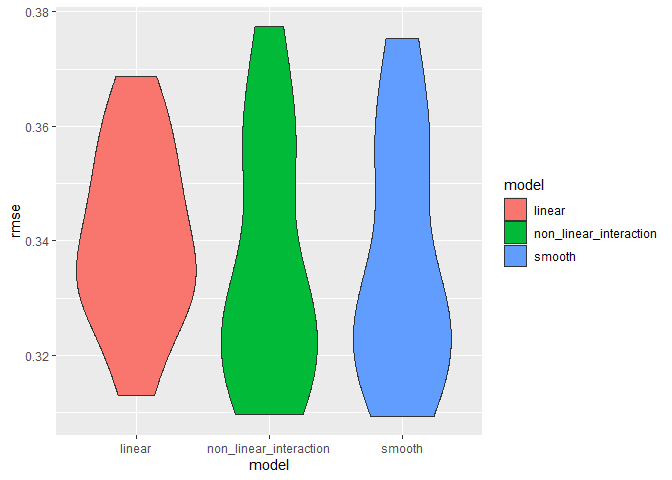<!-- -->

From the box-plots, we can determine that, in general, a person’s O
score tends to decrease as age increases. A person’s C score may have a
positive correlation with a person’s age. It is notable that those age
18-24 have the lowest conscientiousness score. There doesn’t seem to be
an apparent trend in how a person’s agreeableness varies with age.
However, a person’s likelihood to experience negative emotions (N score)
seems to decrease as age increases. Finally, the most striking trend is
observed in sensation seeking, as said trait appears to have a negative
association with age. In particular, age 18-24 have on average the
highest sensation seeking score compared to other age groups.

# Possibility of Other Interactions

``` r
model_full <- lm(log1p(user_consumption_level) ~ (Oscore * Cscore *
                                 AScore * Nscore * SS) + Country + Education + Age + 
                   Gender + Ethnicity + Country, data = data_one)

model_full_1 <- lm(log1p(user_consumption_level) ~ (Oscore * Cscore *
                                 AScore * Nscore * SS) + Education + Age + 
                   Gender + Ethnicity*Country, data = data_one)
```

Throughout our analysis, we observed how variables such as education and
personality traits were often differentiated distributed among other
variables such as age group and country of residence. Thus, we decided
to investigate if there were possible interactions between variables
other than our key personality traits.

After developing one such model accounting for interaction between age
groups and personality trait scores, we compared it to our model for no
interactions. Another model was developed that only took into account
the interactions between country of residence and ethnicity. Below is a
plot that displays the distribution of our root-mean squared error for
each model.

``` r
set.seed(123)

data_one_prime_use_no_use_clean <- data_one_prime_use_no_use |> select(
  Oscore, Cscore, Escore, Ascore, Nscore, Impulsive, SS, Country, Education,
  Age, Gender, Ethnicity, user_consumption_level
)

eth_levels <- unique(data_one_prime_use_no_use_clean$Ethnicity)

cv_df =
  crossv_mc(data_one_prime_use_no_use_clean, 200) |> 
  mutate(
    train = map(train, ~ as_tibble(.x) %>%
                  mutate(Ethnicity = factor(Ethnicity, levels = eth_levels))),
    test = map(test, ~ as_tibble(.x) %>%
                  mutate(Ethnicity = factor(Ethnicity, levels = eth_levels))))

cv_df <- cv_df %>%
  mutate(
    ok = map_lgl(train, ~ "Mixed-Black/Asian" %in% .$Ethnicity)
  ) %>%
  filter(ok)

cv_df = 
  cv_df |> 
  mutate(
    linear_mod  = map(train, \(df) lm(log1p(user_consumption_level) ~ (Oscore * Cscore *
                                 Ascore * Nscore * SS) + Country + Education +
                   Age + Gender + Ethnicity, data = df)),
    linear_mod_interaction  = map(train, \(df) lm(log1p(user_consumption_level) ~ (Oscore * Cscore *
                                 Ascore * Nscore * SS) + Country * Education * Age + 
                   Age * Oscore + Age * Cscore + Age * SS + Age * Nscore +
                   Gender + Ethnicity, data = df)), 
    linear_mod_Country_Ethnicity  = map(train, \(df) lm(log1p(user_consumption_level) ~ (Oscore * Cscore *
                                 Ascore * Nscore * SS) + Country + Education +
                   Age + Gender + Ethnicity*Country, data = df))) |> 
  mutate(
    rmse_linear = map2_dbl(linear_mod, test, \(mod, df) rmse(model = mod, data = df)),
    rmse_linear_interaction    = map2_dbl(linear_mod_interaction, test, \(mod, df) rmse(mod, df)),
    rmse_linear_interaction_Country_Ethnicity    = map2_dbl(linear_mod_Country_Ethnicity, 
                                                            test, \(mod, df) rmse(mod, df)))
```

    ## Warning: There were 304 warnings in `mutate()`.
    ## The first warning was:
    ## ℹ In argument: `rmse_linear_interaction = map2_dbl(...)`.
    ## Caused by warning in `predict.lm()`:
    ## ! prediction from rank-deficient fit; attr(*, "non-estim") has doubtful cases
    ## ℹ Run `dplyr::last_dplyr_warnings()` to see the 303 remaining warnings.

``` r
cv_df |> 
  select(starts_with("rmse")) |> 
  pivot_longer(
    everything(),
    names_to = "model", 
    values_to = "rmse",
    names_prefix = "rmse_") |> 
  mutate(model = fct_inorder(model)) |> 
  ggplot(aes(x = model, y = rmse, fill = model)) + geom_violin()
```

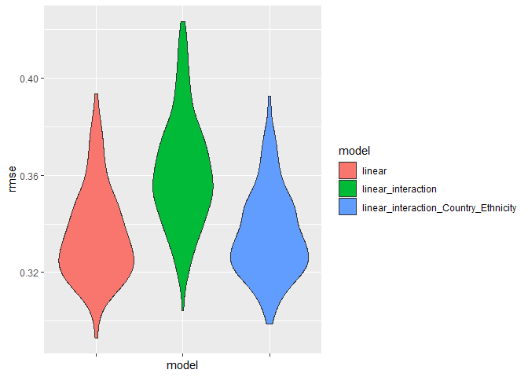<!-- -->

We see that the distribution of the root mean squared error is roughly
the same for both a linear model that takes into account no interactions
beyond personality traits and one that takes into account the effect
that country and ethnicity has on one another. However, as the error
distribution for the other model has a higher RMSE on average, we will
limit our investigation into only the interaction between country and
ethnicity.

``` r
model_no_other_interactions <- lm(log1p(user_consumption_level) ~ (Oscore * Cscore *
                                 AScore * Nscore * SS) + Country + Education + Age + 
                   Gender + Ethnicity + Country, data = data_one)

model_country_ethnicity <- lm(log1p(user_consumption_level) ~ (Oscore * Cscore *
                                 AScore * Nscore * SS) + Country + Education + Age + 
                   Gender + Ethnicity*Country, data = data_one)

knitr::kable(AIC(model_no_other_interactions, model_country_ethnicity))
```

|                             |  df |      AIC |
|:----------------------------|----:|---------:|
| model_no_other_interactions |  59 | 1179.181 |
| model_country_ethnicity     |  72 | 1173.639 |

By conducting an AIC test, we see the model that takes into account the
interaction between country and ethnicity has a lower AIC score,
therefore it is the best model between the two.

# Nonlinear vs Linear Regression

``` r
check_model(model_full_1, check = c("linearity", "outliers", "qq", "normality"))
```

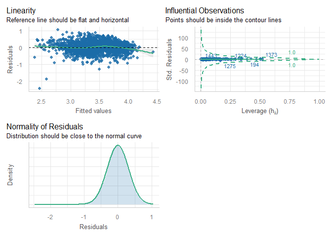<!-- -->

From a simple diagnostic of our linear regression model, our residuals
are averaged around 0 and generally independent from our fitted values.
There also doesn’t seem to be any outliers that are too influential to
the variation in total drug consumption. Finally, the residuals are
approximately normally distributed along 0. This suggests that our
linear model is appropriate for the approximation of total drug
consumption.

However, as a final check, we compared the AIC and RMSE distribution of
our linear model to those of an unlinear model that accounts for
non-linearity in our personality trait scores.

Below are the table and plot showing the AIC score and RMSE
distribution, respectively.

``` r
model_full_nonlinear_no_interaction <- gam(log1p(user_consumption_level) ~ s(Oscore) + s(Cscore) +
                                 s(AScore) + s(Nscore) + s(Impulsive) + s(SS) + Country + Education +
                   Age + Gender + Ethnicity*Country, data = data_one)

knitr::kable(AIC(model_country_ethnicity, model_full_nonlinear_no_interaction))
```

|                                     |       df |      AIC |
|:------------------------------------|---------:|---------:|
| model_country_ethnicity             | 72.00000 | 1173.639 |
| model_full_nonlinear_no_interaction | 54.59517 | 1167.055 |

``` r
set.seed(123)

data_one_prime_use_no_use_clean <- data_one_prime_use_no_use |> select(
  Oscore, Cscore, Escore, Ascore, Nscore, Impulsive, SS, Country, Education,
  Age, Gender, Ethnicity, user_consumption_level
)

cv_df_1 =
  crossv_mc(data_one_prime_use_no_use_clean, 200) |> 
  mutate(
    train = map(train, ~ as_tibble(.x) %>%
                  mutate(Ethnicity = factor(Ethnicity, levels = eth_levels))),
    test = map(test, ~ as_tibble(.x) %>%
                  mutate(Ethnicity = factor(Ethnicity, levels = eth_levels))))

cv_df_1 <- cv_df_1 %>%
  mutate(
    ok = map_lgl(train, ~ "Mixed-Black/Asian" %in% .$Ethnicity)
  ) %>%
  filter(ok)

cv_df_1 = 
  cv_df_1 |> 
  mutate(
    linear_mod  = map(train, \(df) lm(log1p(user_consumption_level) ~ (Oscore + Cscore +
                                 Ascore + Nscore + Impulsive + SS)^6 + Country + Education +
                   Age + Gender + Ethnicity*Country, data = df)),
    non_linear_no_interaction_mod     = map(train, \(df) gam(log1p(user_consumption_level) ~ s(Oscore) + s(Cscore) +
                                 s(Ascore) + s(Nscore) + s(Impulsive) + s(SS) + Country + Education +
                   Age + Gender + Ethnicity*Country, data = df))) |> 
  mutate(
    rmse_linear = map2_dbl(linear_mod, test, \(mod, df) rmse(model = mod, data = df)),
    rmse_non_linear_interaction    = map2_dbl(non_linear_no_interaction_mod, test, \(mod, df) rmse(model = mod, data = df)))
```

    ## Warning: There were 109 warnings in `mutate()`.
    ## The first warning was:
    ## ℹ In argument: `rmse_linear = map2_dbl(...)`.
    ## Caused by warning in `predict.lm()`:
    ## ! prediction from rank-deficient fit; attr(*, "non-estim") has doubtful cases
    ## ℹ Run `dplyr::last_dplyr_warnings()` to see the 108 remaining warnings.

``` r
cv_df_1 |> 
  select(starts_with("rmse")) |> 
  pivot_longer(
    everything(),
    names_to = "model", 
    values_to = "rmse",
    names_prefix = "rmse_") |> 
  mutate(model = fct_inorder(model)) |> 
  ggplot(aes(x = model, y = rmse, fill = model)) + geom_violin()
```

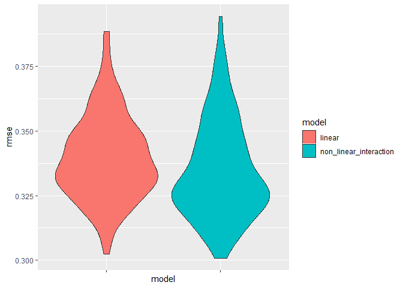<!-- -->

While the non-linear model has a slightly lower AIC score, the
distribution of the RMSE for the non-linear model also tends to have
more probablity around the higher RMSE compared to the linear model.

Thus, for the purposes of predicting total drug use consumption, we
still maintain that the linear model is the most appropriate.

# Best Linear Model

Below are the tables that summarize all the relevant predictors, their
estimated parameters, and the key statistics of our best linear model in
temrs of R squared and p-value.

``` r
model_full_1 |> summary() |>
  broom::tidy() |>
  filter(p.value < 0.05) |>
  filter(term %in% c("Oscore", "Cscore", "Ascore", "Nscore", "SS",
                     "CountryCanada", "CountryUK", "EducationLeft school at 18 years",
                     "EducationLeft school before 16 years",
                     "Age45-54", "Age55-64", "Age65+", "GenderM")) |>
  kbl(
      caption     = "Effect of Psychological Predictors on Drug Consumption Levels", 
      col.names   = c("Predictor", "Estimate", "SE", "t-statistic", "p-value"), 
      digits      = c(3, 3, 3, 3, 3)
  )
```

<table>

<caption>

Effect of Psychological Predictors on Drug Consumption Levels
</caption>

<thead>

<tr>

<th style="text-align:left;">

Predictor
</th>

<th style="text-align:right;">

Estimate
</th>

<th style="text-align:right;">

SE
</th>

<th style="text-align:right;">

t-statistic
</th>

<th style="text-align:right;">

p-value
</th>

</tr>

</thead>

<tbody>

<tr>

<td style="text-align:left;">

Oscore
</td>

<td style="text-align:right;">

0.078
</td>

<td style="text-align:right;">

0.010
</td>

<td style="text-align:right;">

7.904
</td>

<td style="text-align:right;">

0.000
</td>

</tr>

<tr>

<td style="text-align:left;">

Cscore
</td>

<td style="text-align:right;">

-0.066
</td>

<td style="text-align:right;">

0.010
</td>

<td style="text-align:right;">

-6.499
</td>

<td style="text-align:right;">

0.000
</td>

</tr>

<tr>

<td style="text-align:left;">

Nscore
</td>

<td style="text-align:right;">

0.021
</td>

<td style="text-align:right;">

0.010
</td>

<td style="text-align:right;">

2.184
</td>

<td style="text-align:right;">

0.029
</td>

</tr>

<tr>

<td style="text-align:left;">

SS
</td>

<td style="text-align:right;">

0.090
</td>

<td style="text-align:right;">

0.010
</td>

<td style="text-align:right;">

8.613
</td>

<td style="text-align:right;">

0.000
</td>

</tr>

<tr>

<td style="text-align:left;">

EducationLeft school at 18 years
</td>

<td style="text-align:right;">

0.123
</td>

<td style="text-align:right;">

0.050
</td>

<td style="text-align:right;">

2.438
</td>

<td style="text-align:right;">

0.015
</td>

</tr>

<tr>

<td style="text-align:left;">

EducationLeft school before 16 years
</td>

<td style="text-align:right;">

0.244
</td>

<td style="text-align:right;">

0.073
</td>

<td style="text-align:right;">

3.366
</td>

<td style="text-align:right;">

0.001
</td>

</tr>

<tr>

<td style="text-align:left;">

Age45-54
</td>

<td style="text-align:right;">

-0.136
</td>

<td style="text-align:right;">

0.026
</td>

<td style="text-align:right;">

-5.210
</td>

<td style="text-align:right;">

0.000
</td>

</tr>

<tr>

<td style="text-align:left;">

Age55-64
</td>

<td style="text-align:right;">

-0.238
</td>

<td style="text-align:right;">

0.038
</td>

<td style="text-align:right;">

-6.246
</td>

<td style="text-align:right;">

0.000
</td>

</tr>

<tr>

<td style="text-align:left;">

Age65+
</td>

<td style="text-align:right;">

-0.363
</td>

<td style="text-align:right;">

0.082
</td>

<td style="text-align:right;">

-4.408
</td>

<td style="text-align:right;">

0.000
</td>

</tr>

<tr>

<td style="text-align:left;">

GenderM
</td>

<td style="text-align:right;">

0.133
</td>

<td style="text-align:right;">

0.017
</td>

<td style="text-align:right;">

7.874
</td>

<td style="text-align:right;">

0.000
</td>

</tr>

<tr>

<td style="text-align:left;">

CountryUK
</td>

<td style="text-align:right;">

-1.012
</td>

<td style="text-align:right;">

0.209
</td>

<td style="text-align:right;">

-4.850
</td>

<td style="text-align:right;">

0.000
</td>

</tr>

</tbody>

</table>

``` r
model_full_1 |> summary() |> broom::glance() |>
  mutate(model = c("Best Model for total drug consumption")) |>
  relocate(model) |>
  kbl(
    caption     = "Key Statistics for Prediction of User Consumption from Psychological Traits"
    , col.names = c(
        "Model", "R-squared", "Adj. R-squared"
      , "Sigma", "F-statistic", "p-value", "df", "Residual df", "N"
    )
    , digits    = c(1, 2, 2, 0, 2, 5, 0, 0, 0)
  )
```

<table>

<caption>

Key Statistics for Prediction of User Consumption from Psychological
Traits
</caption>

<thead>

<tr>

<th style="text-align:left;">

Model
</th>

<th style="text-align:right;">

R-squared
</th>

<th style="text-align:right;">

Adj. R-squared
</th>

<th style="text-align:right;">

Sigma
</th>

<th style="text-align:right;">

F-statistic
</th>

<th style="text-align:right;">

p-value
</th>

<th style="text-align:right;">

df
</th>

<th style="text-align:right;">

Residual df
</th>

<th style="text-align:right;">

N
</th>

</tr>

</thead>

<tbody>

<tr>

<td style="text-align:left;">

Best Model for total drug consumption
</td>

<td style="text-align:right;">

0.53
</td>

<td style="text-align:right;">

0.51
</td>

<td style="text-align:right;">

0
</td>

<td style="text-align:right;">

29.23
</td>

<td style="text-align:right;">

0
</td>

<td style="text-align:right;">

70
</td>

<td style="text-align:right;">

1805
</td>

<td style="text-align:right;">

1876
</td>

</tr>

</tbody>

</table>

# Interpretation of Best Linear Model

From our linear model, taking into account possible interactions, it
seems that as the O score increases, a user’s log of their total drug
consumption would increase by 0.078. Meanwhile, as a user’s C score
decreases by 1, the user’s log total consumption increases by 0.066. As
a user’s sensation seeking increases, their log consumption increases by
0.09. For the last personality trait, as a user’s N score increases by
1, their log consumption increases by 0.021.

As for our other variables, those who reside in the country of UK have a
lower log total consumption of 1.012 as compared to other countries.
Those who left school at 18 years or before 16 years have a higher log
total consumption of 0.123 and 0.244 compared to other education groups,
respectively.

For the age groups, those age 45-54, 55-64, and 65+ have a lower log
total drug consumption of 0.136, 0.238, and 0.363 compared to other age
groups, respectively.

Finally, for users who are of the male gender, their log total drug
consumption is 0.133 higher compared to those who are female.
