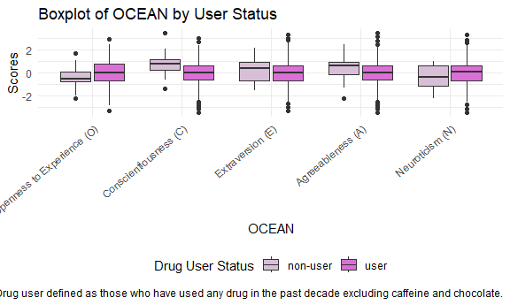
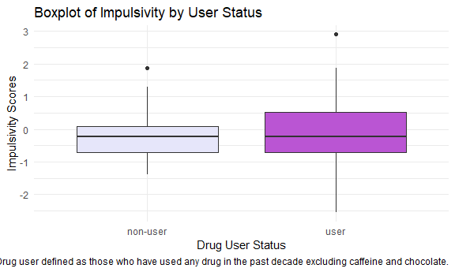
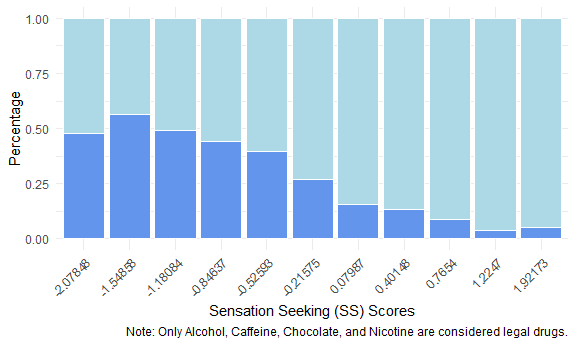
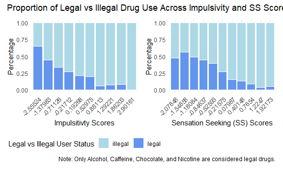
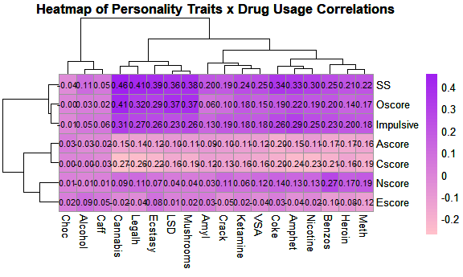

Exploratory Data Analysis
================

``` r
# Load in relevant libraries
library(tidyverse)
```

    ## ── Attaching core tidyverse packages ──────────────────────── tidyverse 2.0.0 ──
    ## ✔ dplyr     1.1.4     ✔ readr     2.1.5
    ## ✔ forcats   1.0.0     ✔ stringr   1.5.2
    ## ✔ ggplot2   4.0.0     ✔ tibble    3.3.0
    ## ✔ lubridate 1.9.4     ✔ tidyr     1.3.1
    ## ✔ purrr     1.1.0     
    ## ── Conflicts ────────────────────────────────────────── tidyverse_conflicts() ──
    ## ✖ dplyr::filter() masks stats::filter()
    ## ✖ dplyr::lag()    masks stats::lag()
    ## ℹ Use the conflicted package (<http://conflicted.r-lib.org/>) to force all conflicts to become errors

``` r
library(patchwork)
library(ggplot2)
library(pheatmap)
```

    ## Warning: package 'pheatmap' was built under R version 4.5.2

``` r
# default options
knitr::opts_chunk$set(
  fig.width = 6,
  fig.asp = .6,
  out.width = "90%"
)

theme_set(theme_minimal() + theme(legend.position = "bottom"))

options(
  ggplot2.continuous.colour = "viridis",
  ggplot2.continuous.fill = "viridis"
)

scale_colour_discrete = scale_colour_viridis_d
scale_fill_discrete = scale_fill_viridis_d
```

``` r
# Read in cleaned dataset
drug_data = read_csv("data/cleaned_drug_data.csv") |>
  mutate(
    Gender = as.factor(Gender))
```

    ## Rows: 1876 Columns: 31
    ## ── Column specification ────────────────────────────────────────────────────────
    ## Delimiter: ","
    ## chr  (3): Education, Country, Ethnicity
    ## dbl (28): ID, Age, Gender, Nscore, Escore, Oscore, Ascore, Cscore, Impulsive...
    ## 
    ## ℹ Use `spec()` to retrieve the full column specification for this data.
    ## ℹ Specify the column types or set `show_col_types = FALSE` to quiet this message.

``` r
# Create version of the dataset where we collapse drug use levels into binary values (drug user or non-user)
# 0-1: non-user
# 2–6: user
usage_data = drug_data |>
  mutate(across(14:31, ~ factor(ifelse(.x %in% 0:1, "non-user",
                         ifelse(.x %in% 2:6, "user", NA)),
                         levels = c("non-user", "user"))),
         # define harmful user as those who have used any drug in the past decade excluding chocolate and caffeine
         harmfuluser_status = factor(if_else(rowSums(across(c(14:31, -Caff, -Choc)) == "user", 
                                                     na.rm = TRUE) > 0, "user", "non-user"),
                              levels = c("non-user", "user")),
         # define user as those who have used any drug in the past decade
         user_status = factor(if_else(rowSums(across(c(14:31)) == "user", 
                                                     na.rm = TRUE) > 0, "user", "non-user"),
                              levels = c("non-user", "user")))

# Create version of the dataset where I remove non-users and create a binary legal user vs. illegal user indicator "legaluser_status"
# Alcohol, Caff, Choc, Nicotine considered legal drugs, everything else illegal
legalusage_data = usage_data |>
  filter(user_status == "user") |>
  select(-harmfuluser_status, -user_status) |> 
  mutate(# define legal user as those who used any legal drug in the past decade, illegal otherwise
    legaluser_status = factor(if_else(rowSums(across(c(14:31, -Alcohol, -Caff, -Choc, -Nicotine)) == "user", 
                                              na.rm = TRUE) > 0, "illegal", "legal"),
                              levels = c("illegal", "legal")))

# Create version of the dataset where I remove non-users and create a binary legal user vs. illegal user indicator "legaluser_status" but keep all the drug levels as ordinal
legalusage_ordinal_data = drug_data |>
  mutate(
    user_status = usage_data$user_status
  ) |> 
  filter(user_status == "user") |>
  select(-user_status) |>
  mutate(
    legaluser_status = legalusage_data$legaluser_status
  )

# Gender
# 0: male
# 1: female

# Drug use
# 0: never used
# 1: used over a Decade Ago
# 2: used in Last Decade
# 3: used in Last Year
# 4: used in Last Month
# 5: used in Last Week
# 6: used in Last Day

# Age
# 1: 18-24
# 2: 25-34
# 3: 35-44
# 4: 45-54
# 5: 55-64
# 6: 65+
```

# Trait distributions

## Histogram of OCEAN Scores

``` r
O_hist = drug_data |> 
  ggplot(aes(x = Oscore)) + 
  geom_histogram(fill = "#F4C2C2", color = "white", binwidth = 0.4) +
  labs(
    x = "Openness to Experience (O)",
    y = "Count"
  ) 
C_hist = drug_data |> 
  ggplot(aes(x = Cscore)) + 
  geom_histogram(fill = "#FFB6C1", color = "white", binwidth = 0.4) +
  labs(
    x = "Conscientiousness (C)",
    y = "Count"
  ) 

E_hist = drug_data |> 
  ggplot(aes(x = Escore)) + 
  geom_histogram(fill = "#FFA6C9", color = "white", binwidth = 0.4) +
  labs(
    x = "Extraversion (E)",
    y = "Count"
  ) 

A_hist = drug_data |> 
  ggplot(aes(x = Ascore)) + 
  geom_histogram(fill = "#FF1493", color = "white", binwidth = 0.4) +
  labs(
    x = "Agreeableness (A)",
    y = "Count"
  ) 

N_hist = drug_data |> 
  ggplot(aes(x = Nscore)) + 
  geom_histogram(fill = "#F9429E", color = "white", binwidth = 0.4) +
  labs(
    x = "Neuroticism (N)",
    y = "Count"
  ) 

OCEAN_hist = (O_hist + C_hist + E_hist) / (A_hist + N_hist) + 
  plot_annotation(
    title = "Distribution of OCEAN Scores"
  )

OCEAN_hist
```


``` r
ggsave("figs/hist_ocean.png", OCEAN_hist)
```

    ## Saving 6 x 3.59 in image

Observations: All OCEAN scores seem to show a normal distribution.

## Histogram of impulsivity

``` r
impulsivity_hist = drug_data |> 
  ggplot(aes(x = Impulsive)) + 
  geom_histogram(fill = "#FFE4E1", color = "white", binwidth = 0.4) +
  labs(
    x = "Impulsivity",
    y = "Count",
    title = "Distribution of Impulsivity Scores"
  ) 

impulsivity_hist
```


``` r
ggsave("figs/hist_impulsivity.png", impulsivity_hist)
```

    ## Saving 6 x 3.59 in image

Observations: Impulsiveness scores seem to show a right skewed
distribution.

## Histogram of sensation seeking

``` r
SS_hist = drug_data |> 
  ggplot(aes(x = SS)) + 
  geom_histogram(fill = "#FFB7C5", color = "white", binwidth = 0.3) +
  labs(
    x = "Sensation Seeking (SS)",
    y = "Count",
    title = "Distribution of SS Scores"
  ) 

SS_hist
```


``` r
ggsave("figs/hist_impSS.png", SS_hist)
```

    ## Saving 6 x 3.59 in image

Observations: Sensation seeking scores seem to show a left skewed
distribution.

# Traits by User Status

## Boxplot of OCEAN by user status

``` r
OCEAN_boxplot = usage_data |> 
  pivot_longer(
    Nscore:Cscore,
    names_to = "OCEAN", 
    values_to = "Score") |> 
  mutate(OCEAN = fct_relevel(OCEAN, c("Oscore", "Cscore", "Escore", "Ascore", "Nscore"))) |>
  ggplot(aes(x = OCEAN, y = Score, fill = harmfuluser_status)) + 
  geom_boxplot() +
  labs(
    x = "OCEAN",
    y = "Scores",
    fill = "Drug User Status",
    title = "Boxplot of OCEAN by User Status",
    caption = "Note: Drug user defined as those who have used any drug in the past decade excluding caffeine and chocolate."
  ) +
  scale_fill_manual(values = c("non-user" = "#D8BFD8", "user" = "#DA70D6")) +
  scale_x_discrete(labels = c("Openness to Experience (O)", "Conscientiousness (C)", "Extraversion (E)",
                              "Agreeableness (A)", "Neuroticism (N)")) +
  theme(axis.text.x = element_text(angle = 40, hjust = 1))

OCEAN_boxplot
```



``` r
ggsave("figs/box_ocean_user.png", OCEAN_boxplot)
```

    ## Saving 6 x 3.59 in image

Observations: The distribution of OCEAN scores in drug users vs non-drug
users are not significantly different. The median openness to experience
and neuroticism scores are lower in non drug users than drug users. The
median conscientiousness, extraversion, and agreeableness scores are
higher in non drug users than drug users. Drug users have a larger range
of OCEAN scores than non-users.

## Boxplot of impulsivity by user status

``` r
impulsivity_boxplot = usage_data |> 
  ggplot(aes(x = harmfuluser_status, y = Impulsive, fill = harmfuluser_status)) + 
  geom_boxplot() +
  labs(
    x = "Drug User Status",
    y = "Impulsivity Scores",
    title = "Boxplot of Impulsivity by User Status",
    caption = "Note: Drug user defined as those who have used any drug in the past decade excluding caffeine and chocolate."
  ) +
  scale_fill_manual(values = c("non-user" = "#E6E6FA", "user" = "#BA55D3")) +
  theme(legend.position = "none")

impulsivity_boxplot
```



``` r
ggsave("figs/box_impulsivity_user.png", impulsivity_boxplot)
```

    ## Saving 6 x 3.59 in image

Observations: The distribution of Impulsiveness scores in drug users vs
non-drug users are not significantly different. The median impulsivity
score for non-users and users seem to be about the same. The impulsivity
scores for drug users is has a larger third quartile than non-users.

# Legal vs Illegal Usage

## Stacked barplot of legal vs illegal usage

``` r
I_stacked = legalusage_data |> 
  ggplot(aes(x = factor(Impulsive), fill = legaluser_status)) +
  geom_bar(position = "fill", color = "white") +
  labs(
    x = "Impulsitivty Scores", 
    y = "Percentage", 
    fill = "Legal vs Illegal User Status"
    ) +
  scale_fill_manual(values = c("legal" = "#6495ED", "illegal" = "#ADD8E6")) +
  theme(axis.text.x = element_text(angle = 45, hjust = 1))
I_stacked
```


``` r
SS_stacked = legalusage_data |> 
  ggplot(aes(x = factor(SS), fill = legaluser_status)) +
  geom_bar(position = "fill", color = "white") +
  labs(
    x = "Sensation Seeking (SS) Scores", 
    y = "Percentage",
    caption = "Note: Only Alcohol, Caffeine, Chocolate, and Nicotine are considered legal drugs."
    ) +
  scale_fill_manual(values = c("legal" = "#6495ED", "illegal" = "#ADD8E6")) +
  theme(legend.position = "none") +
  theme(axis.text.x = element_text(angle = 45, hjust = 1))
SS_stacked
```



``` r
Imp_SS_stacked = (I_stacked + SS_stacked) +
  plot_annotation(
    title = "Proportion of Legal vs Illegal Drug Use Across Impulsivity and SS Scores"
  )

Imp_SS_stacked
```



``` r
ggsave("figs/stacked_legal_illegal.png", Imp_SS_stacked)
```

    ## Saving 6 x 3.59 in image

Observations: As impulsivity scores increase, the proportion of illegal
drug users increase and the proportion of legal drug users decrease. As
sensation seeking scores increase, the proportion of illegal drug users
increase and the proportion of legal drug users decrease. This indicates
that there seems to be a relationship between higher impulsivity and
sensation seeking scores and being a illegal drug user.

## Heatmap of correlations

``` r
correlation_matrix = cor(legalusage_ordinal_data[7:13], legalusage_ordinal_data[14:31])

corr_heatmap = pheatmap(correlation_matrix,
                        color = colorRampPalette(c("pink", "purple"))(50),
                        number_color = "black",
                        display_numbers = TRUE,
                        cluster_rows = TRUE,
                        cluster_cols = TRUE,
                        main = "Heatmap of Personality Traits x Drug Usage Correlations")

corr_heatmap
```



``` r
ggsave("figs/heatmap_traits_usage.png", corr_heatmap)
```

    ## Saving 6 x 3.59 in image

Observations: The variables Alcohol, Caff, and Choc seem to be similar
to and more correlated with each other which makes sense because they
are legal drugs. An increase in SS scores, Oscore, and Impulsiveness
scores seem to be moderately correlated with an increase in Cannabis,
Legalh, Ecstasy, LSD, and Mushrooms usage in the past decade (these
variables have a positive correlation). This indicates that being more
sensation seeking, open to experiences, and impulsive are moderately
associated with higher illegal drug usage of Cannabis, legal highs
consumption, Ecstasy, LSD, and Mushrooms. An increase in especially
cannabis and Legalh usage is associated with lower Cscore which means
lower drug usage is weakly associated with lower drug usage of Cannabis
and legal highs consumption.
